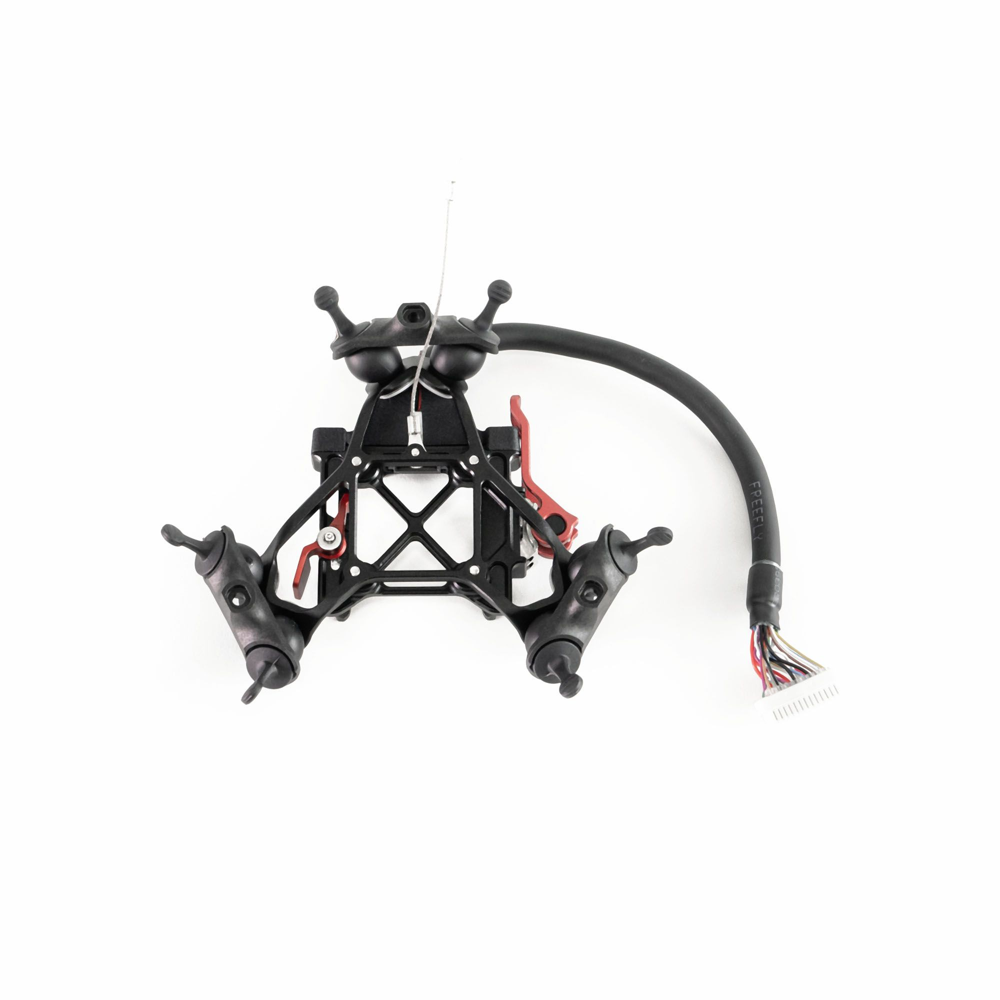

# Smart Dovetail Isolator System

The Smart Dovetail Isolator System provides payload mounting while reducing aircraft vibrations transferred to the payload for smooth footage and reduced component fatigue.


Smart Dovetail is not hotswap compatible. Power off the aircraft before attaching or removing a Smart Dovetail payload.


## Tension Isolator (Astro Isolator)

<figure><figcaption></figcaption></figure>



The Astro Isolator is optimized for payloads up to 1.5 kg / 3.31 lb that use the Smart Dovetail. It mounts directly to the chassis of Astro with included M3 fasteners and includes a lanyard for added safety.

**Ships default on:** Astro, Astro Max

The isolator comes with 30A durometer dampers pre-installed (as well as a spare set) which work well for most payloads. These can be replaced with 40A/50A dampers if more stiffness is needed for your application.



For installation instructions, see:



## Compression Isolator

This new compression design isolator system is optimized for payloads up to 3.0 kg / 6.6 lb that use the Smart Dovetail. It reduces vibrations for smooth footage and reduced component fatigue.

**Ships default on:** Alta X Gen2

**Upgrade option for:** Astro Max

There are three options of dampers to accommodate a range of payload weights and flying conditions:

| Durometer | Payload Weight         | Notes                                                                     |
| --------- | ---------------------- | ------------------------------------------------------------------------- |
| 30A       | Under 1.0kg / 2.2lbs   | Standard option for Freefly Payloads (A7R IV, LR1, Wiris Pro, Ventus OGI) |
| 50A       | 1.0-2.0kg / 2.2-4.4lbs |                                                                           |
| 70A       | Up to 3.0kg / 6.6lbs   | For heavier payloads or if more stiffness is needed                       |

Dampers are easy to swap in the field (requires 2mm hex driver) and durometers are laser engraved on the cartridge for easy identification.


For Freefly payloads on Astro Max, extended landing gear (Astro Max Landing Gear or Sentera Extended Landing Gear) is required for vertical payload clearance.


For installation instructions:

* **Astro Max:** See [Vibration Isolators](https://docs.freeflysystems.com/astro/ecosystem/components/vibration-isolators)
* **Alta X Gen2:** See [Rails and Isolator](https://docs.freeflysystems.com/alta-x-gen2/maintenance/rails-and-isolator)

## Maintenance

Check all dampers are in good condition before each flight, as these can wear out over time. We recommend replacing dampers every 6-12 months.



## Compatible Payloads

The Smart Dovetail Isolator System is compatible with payloads that use the Smart Dovetail standard, including:

* LR1 Payload
* A7R4 Payload
* Wiris Pro Payload
* Ventus OGI Payload
* Flux
* Gremsy VIO and Pixy
* Sentera 6X/65R
