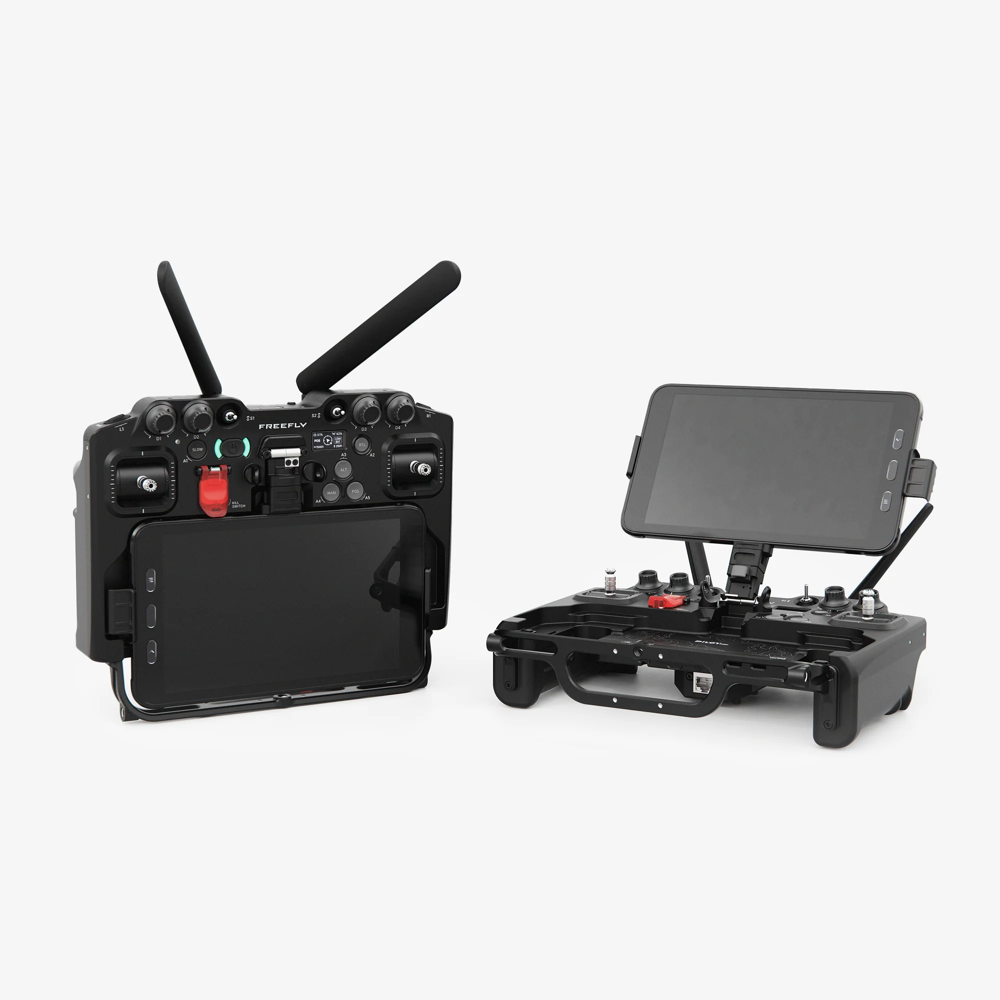

# Intro

<figure><figcaption></figcaption></figure>

The Pilot Pro drone controller is the perfect companion for your next mission.

Combining US-made craftsmanship, modular radio transmitter options, and the latest in onboard emergency safety features, you'll be ready to take flight with confidence.

Enjoy precise camera and gimbal control with high-resolution rockers. Control all key user actions discreetly with the physical inputs. The custom-configured 8" Samsung Tab Active5 and user neck harness round out the platform for mission success.

Pilot Pro is available with Herelink Radio (2.4 GHz) which is used for Alta X and Astro, Doodle Radio  that's used for NDAA/Blue compliant Astro, and RFD900 that's used for NDAA/Blue compliant Alta X. &#x20;

