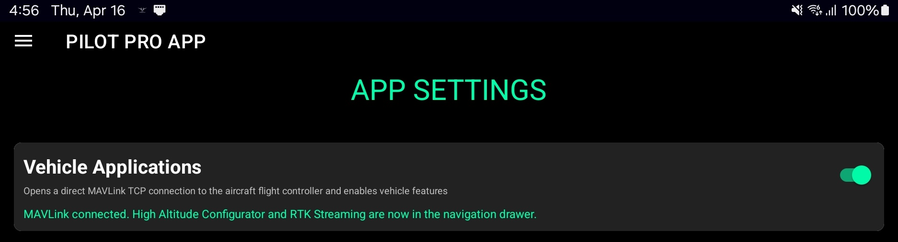
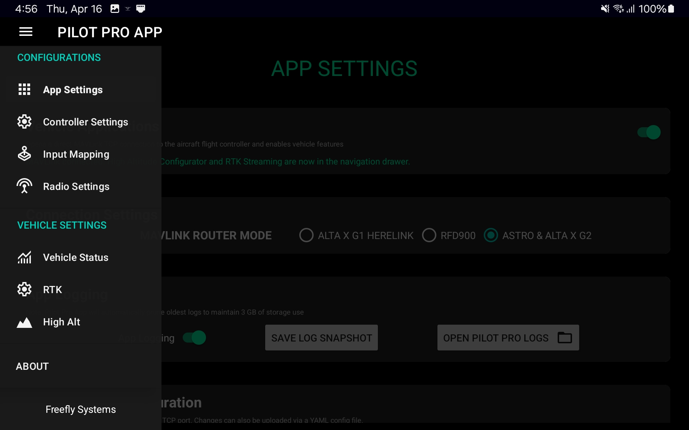
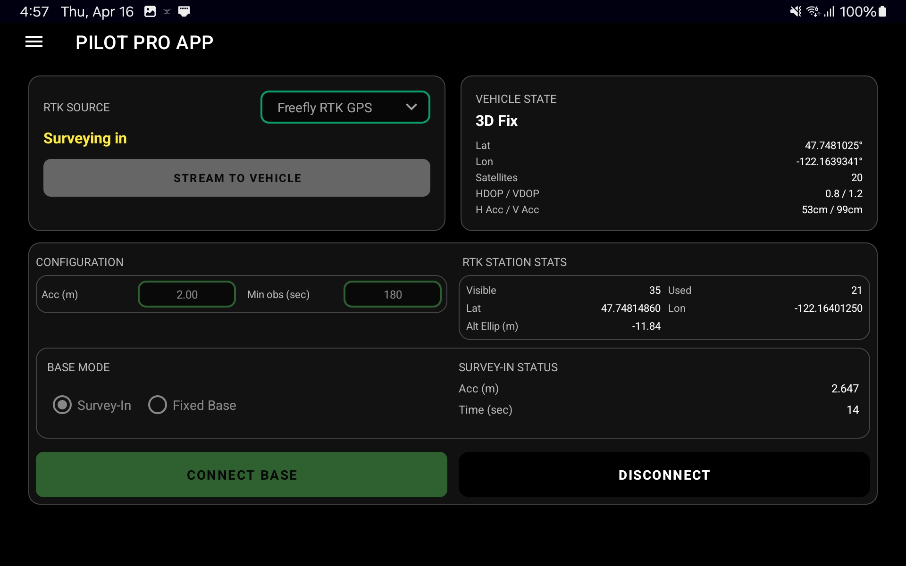
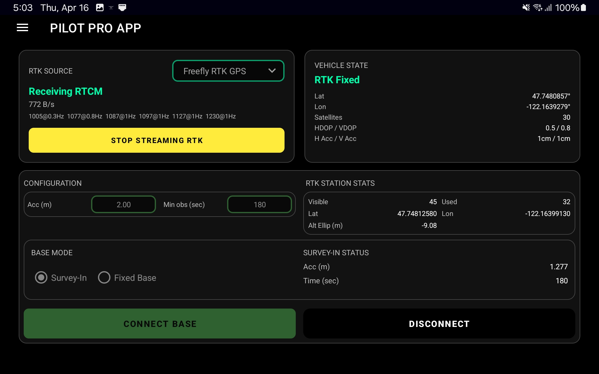
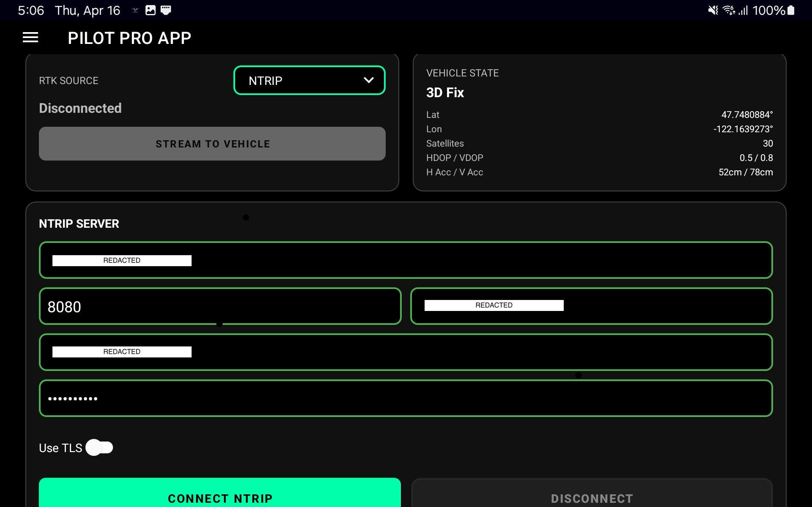
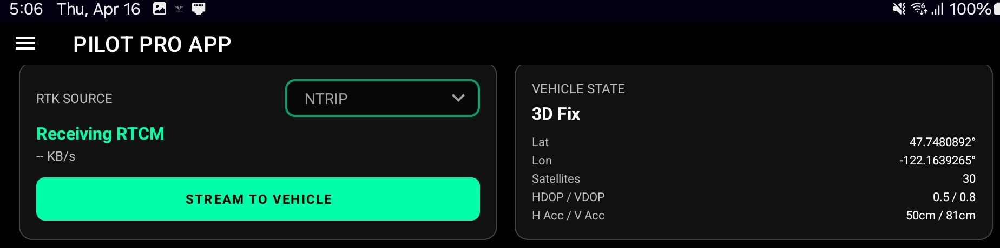

# RTK and NTRIP

Pilot Pro App v2.7.4 and later adds a direct RTK workflow on the controller. You no longer need a separate laptop and RJ45 connection for the standard Freefly RTK setup.


Use the direct workflow below with **Pilot Pro App v2.7.4 or later**. If you need to update, see [Software and Firmware Updates](../../maintenance/software-and-firmware-updates/).


### Direct setup on Pilot Pro App v2.7.4+

#### What you need

* Astro / Alta X.
  * Make sure to disable NTRIP App on your drone (via 10.41.1.1 when connected via drone USB-C or 192.168.144.20 from the browser on Pilot Pro)&#x20;
* Pilot Pro with Herelink / Doodle Labs
* For RTK mode: Freefly RTK Base Station
* USB-C cable for the RTK Base Station to Pilot Pro USB user port
* For NTRIP mode: internet connection on the Pilot Pro tablet


**Vehicle Apps** only enables while Pilot Pro is connected to the aircraft. You must turn it on each time you restart Pilot Pro or relaunch the app. This is intentional while the feature is new because it creates a new MAVLink instance over the radio link.




### Connect the hardware

Power on the aircraft and Pilot Pro.

Wait for Pilot Pro to connect to the aircraft.

If you are using a Freefly RTK Base Station, connect it directly to the **Pilot Pro USB-C user port**.

If you are using NTRIP, connect the Pilot Pro tablet to the internet.



### Enable Vehicle Apps

Open **Pilot Pro App → App Settings**.

Enable **Vehicle Applications**.

This lets the Pilot Pro App speak MAVLink with the aircraft.

This toggle only appears when Pilot Pro is connected to the drone.

<figure><figcaption>
Enable Vehicle Applications in App Settings.
</figcaption></figure>



### Open RTK

Open the navigation drawer in **Pilot Pro App**.

Scroll down and select **RTK**.

<figure><figcaption>
Open the RTK page from the navigation drawer.
</figcaption></figure>



### Select your correction source

Use the mode dropdown to choose **RTK** or **NTRIP**.

* **RTK** uses a connected base station.
* **NTRIP** uses correction data from the tablet's internet connection.

When NTRIP is active, Pilot Pro streams the correction data to the aircraft over the radio link.



### Finish setup



#### Connect the base

The **CONNECT BASE** button appears when the Freefly RTK Base Station is connected.

Allow Pilot Pro App to access the base station device.

Deny access requests from other apps that try to claim the same device.

#### Choose the base mode

Select how the base station location is determined.

* **Fixed Base** uses a known base coordinate.
* **Survey-In** averages the base position before corrections start.

Survey-In uses the configured accuracy and minimum observation time before correction streaming can begin.

#### Stream corrections to the aircraft

Tap **CONNECT BASE**.

When **STREAM TO VEHICLE** becomes available, tap it to start sending correction data to the aircraft.

To stop streaming, tap **STOP STREAMING RTK**.

<figure><figcaption>
Connect the base and configure Fixed Base or Survey-In.
</figcaption></figure>

<figure><figcaption>
Start or stop RTK correction streaming to the aircraft.
</figcaption></figure>



#### Enter server details

Enter your NTRIP server details and connect.

The app can also connect to a VRS mountpoint.

#### Stream corrections to the aircraft

Once Pilot Pro App connects to the NTRIP server, tap **STREAM TO VEHICLE**.

You can tap **DISCONNECT** to stop streaming and disconnect from the server.

You can tap **STOP STREAMING RTK** to stop forwarding correction data while staying connected to the server.

<figure><figcaption>
Enter NTRIP server details and connect.
</figcaption></figure>

<figure><figcaption>
Stream, stop streaming, or disconnect from the NTRIP session.
</figcaption></figure>





### Fixed Base vs Survey-In

Choose **Fixed Base** when you know the exact base station position.

This is the best option for absolute accuracy. It is the recommended mode when you have surveyed coordinates or a known control point.

Choose **Survey-In** when you do not know the exact base position.

Survey-In lets the base station average its position for a set observation time. RTK starts once the requested accuracy threshold is met.

Survey-In is easier to use in the field. Fixed Base is more accurate when the base position is known.

***

## Legacy RTK Setup Workflow

### Original workflow for Pilot Pro App v2.7.3 and earlier

Use this workflow if you are on an older Pilot Pro App version, or if you want to keep using the laptop-based setup.

#### What you need

* Astro / Alta X
* Pilot Pro with Herelink / Doodle Labs
* Freefly RTK Base Station
* Laptop / computer
* Ethernet cable
* USB to Ethernet adapter if your computer does not have an ethernet port
* USB-C cable for the RTK Base Station


If you are using a Doodle Labs radio on Blue/NDAA configurations, first [enable the RJ45 ethernet port](../radio-modules/doodle-labs-radio-module/doodle-rj45-ethernet-port.md) on the back of the module.


### Set up hardware connections

Connect the following devices:

* Pilot Pro to the computer with an ethernet cable
* Freefly RTK Base Station to the computer with a USB cable

<figure><figcaption>
RTK plugged into the computer over USB, with the Pilot Pro connected to the computer over ethernet
</figcaption></figure>

### Set up computer networking

[Video Link: Setting up an ethernet connection on your computer with Pilot Pro](https://www.loom.com/share/2dffce4dbba84941b147b0d292017473)

On the computer, configure the ethernet adapter IPv4 properties to a static IP:

* IP: `192.168.144.199`
* Subnet mask: `255.255.255.0`

<figure><figcaption>
Windows example of static IP configuration
</figcaption></figure>

### Configure AMC or QGC



#### Comm link configuration

In AMC on your computer, navigate to **Settings → Comm Links**.

Add a TCP comm link with these settings:

* Name: `<User Specified>`
* Type: `TCP`
* Host Address: `192.168.144.20`
* TCP Port: `5790`

<figure><figcaption>
Comm link setting
</figcaption></figure>

Enable the comm link after you create it.

#### Base station location

Under **Settings → General → RTK GPS**, choose how the RTK base station location is determined.

This setting only appears after you enable [AMC Advanced mode](https://docs.auterion.com/hardware-integration/flight-controller-customization/amcs-advanced-mode#enable-advanced-mode-in-amc).

* **Survey-In** listens for GPS for the specified observation time.
* RTK starts when the measured accuracy is below the specified threshold.
* If you know the exact base position, use the specified base position for higher accuracy.

<figure><figcaption>
Recommended RTK option
</figcaption></figure>



QGC usually connects automatically after the hardware and network steps above.

If you do not see a connection, add a UDP comm link manually.

#### Add a UDP comm link

In QGC on your computer, navigate to **Application Settings → Comm Links**.

Add a UDP comm link with these settings:

* Name: `<User Specified>`
* Type: `UDP`
* Host Address: `192.168.144.12`
* UDP Port: `14553`

<figure><figcaption>
Where to add a comm link
</figcaption></figure>

<figure><figcaption>
Comm link settings
</figcaption></figure>

#### Bypass firewall if needed

If QGC still does not connect, you may need to add an inbound firewall rule.

This Windows example requires admin permissions.

1. Open **Windows Defender Firewall with Advanced Security**.
2. Under **Inbound Rules**, select **New Rule...**
3. Create a rule with these settings:
   * Port Rule
   * UDP Rule
   * Specific local ports: `14553`
   * Allow the connection
   * Rule applies to Domain, Private, Public
   * Give the rule a name and save it

#### RTK options

Under **Application Settings → General → RTK GPS**, choose how the RTK base station location is determined.

* **Survey-In** listens for GPS for the specified observation time.
* RTK starts when the measured accuracy is below the specified threshold.
* If you know the exact base position, use the specified base position for higher accuracy.

<figure><figcaption>
Recommended RTK option
</figcaption></figure>


