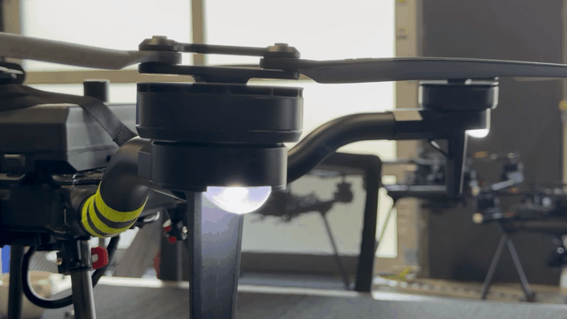

# Doodle Binding / Pairing

* Ensure that your air and ground radios are at least 2 feet apart. Doodle radios are powerful, and if they are too close, they may create interference with each other.
* Power on the Drone with one battery.
* Power on Pilot Pro.
* Give it time. Each radio takes about 60 seconds from power-up to fully boot its system. Ensure both the air and ground radios have been powered on for at least 60 seconds before checking connectivity.
* Open the Pilot Pro App and open the side menu. Navigate to "Radio Settings".

<figure><figcaption></figcaption></figure>

* Open "Pairing Manager" tab

<figure><figcaption></figcaption></figure>

*   Find the bind button under the Drone. Its next to the yellow XT connector on the IO Panel.

    <figure><figcaption></figcaption></figure>
*   Press on the bind button 3 times quickly. Then make sure the boom LEDs starts blinking white to indicate the Radio went into Binding mode.  

    > The boom LEDs blink during pairing only on drone firmware **v2.3.7 or later**.

     

<figure><figcaption></figcaption></figure>

* Then press Scan in the Pilot Pro App. From the list of results, find the one that matches the Drone's serial number. Then press pair.

<figure><figcaption></figcaption></figure>

* Wait until the Pilot Pro app says Pairing Successful and the boom LEDs go back to its original colors.&#x20;
