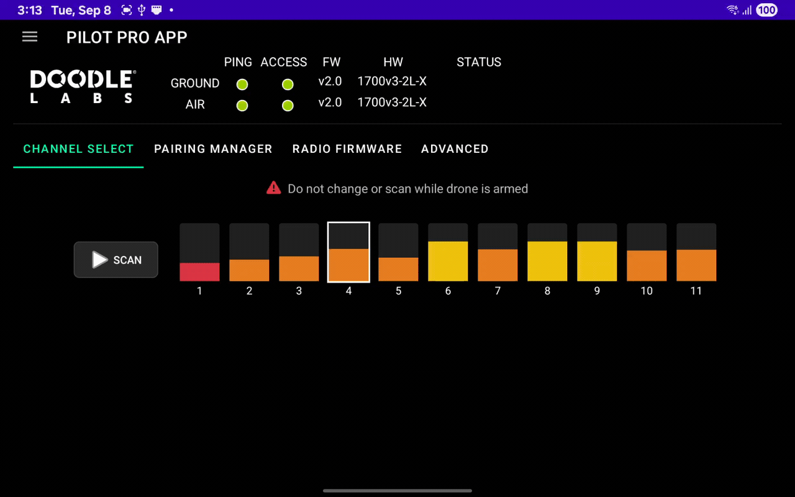

# Doodle Channel Scanning and Selection

Unlike Herelink radios, which automatically hop channels to avoid interference, Doodle radios operate on a fixed channel.

It is important to select an optimal channel to maximize radio range and performance.

Astro's Doodle radios operate in the 2.4 GHz band, which other Wi-Fi systems also use. By default, units ship from the factory with channel 3 selected. This channel avoids most typical Wi-Fi routers.

## Scanning


[Update to the latest Pilot Pro app](../../../maintenance/software-and-firmware-updates/) for the most reliable channel scans.




### Ensure Astro is Powered Off

This will ensure that the Astro's radio will not negatively impact the results of the scan. The app will warn you if you attempt to scan while Astro is powered on (this can be disregarded if you wish to continue anyway).



### Open Pilot Pro App

Navigate to Radio Settings > Channel Select



<figure><figcaption>
Navigating to Radio Settings in the Pilot Pro App
</figcaption></figure>

<figure><figcaption>
Starting a Channel Scan in the Pilot Pro App
</figcaption></figure>



### Begin Scan

Once you begin scanning, there will be a progress bar. This can take at least 1 minute to complete, but sometimes more depending on your environment.

Note that older versions of Pilot Pro may require you to manually stop the scan.



### Analyze Results

After scanning starts, the app displays a visualization when the scan completes.

Below is an example of the results in a busy RF environment (e.g. indoors in a busy office), without any clear "green" channels to choose from.&#x20;

These graphs are visual representation of absolute quality, ranging from red to green, with red being the busiest/worst channels to use for this particular environment.

The best channel to choose is up to you. In general, look for green channels that are as far away from red channels as possible.

<figure><figcaption>
Pilot Pro app with Completed Channel Scan
</figcaption></figure>



### Advanced Diagnostics

Detailed statistics are available by navigating to the "Advanced" tab, and tapping "Scan Diagnostics".

<figure><figcaption>
Accessing Doodle Labs Scan Diagnostics
</figcaption></figure>

<figure><figcaption>
Pilot Pro Scan Diagnostics
</figcaption></figure>

There will be a recommended channel at the top, with a score out of 100. In general, this will be the best choice, but ultimately the choice is up to you. The next section goes over how to actually switch channels.



## Channel Selection & Switching



### Power On Astro

Wait until the Astro has booted and connected to the Pilot Pro. If you are not already here after channel scanning, navigate to Radio Settings > Channel Select. You can confirm the two radio modules are connected by the green bubbles:

<figure><figcaption></figcaption></figure>


If you switch channels while Astro is powered off, the radios will no longer be on the same channel.&#x20;

You will need to either switch back to the original channel, or go through the [pairing/binding process](doodle-binding-pairing.md).




### Choose Channel

Once you've analyze which channel you prefer, tap on your preferred channel. When prompted, confirm.

This process will take up to 1 minute to complete. Losing connection is normal, and you will see the status change as the channel switch is applied to both ground and air radios.

<figure><figcaption></figcaption></figure>




## Doodle Channel Allocation

Each channel is 10 MHz wide and uses the same center frequency as 2.4 GHz Wi-Fi. The allocations are:

<table data-search="false"><thead><tr><th>Channel Number</th><th>Center Frequency (MHz)</th><th>Frequency Range (MHz)</th><th data-hidden></th></tr></thead><tbody><tr><td>1</td><td>2412</td><td>2407-2417</td><td></td></tr><tr><td>2</td><td>2417</td><td>2412-2422</td><td></td></tr><tr><td>3</td><td>2422</td><td>2417-2427</td><td></td></tr><tr><td>4</td><td>2427</td><td>2422-2432</td><td></td></tr><tr><td>5</td><td>2432</td><td>2427-2437</td><td></td></tr><tr><td>6</td><td>2437</td><td>2432-2442</td><td></td></tr><tr><td>7</td><td>2442</td><td>2437-2447</td><td></td></tr><tr><td>8</td><td>2447</td><td>2442-2452</td><td></td></tr><tr><td>9</td><td>2452</td><td>2447-2457</td><td></td></tr><tr><td>10</td><td>2457</td><td>2452-2462</td><td></td></tr><tr><td>11</td><td>2462</td><td>2457-2467</td><td></td></tr></tbody></table>
