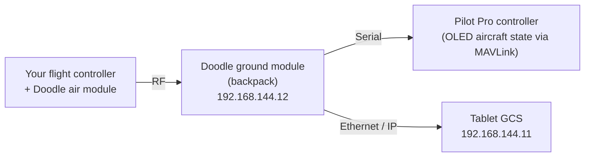

# Doodle Labs Solo

## Integrator Kit (Doodle Labs RF)


**This is not a turnkey product.** The Pilot Pro Integrator Kit is a ground-side controller intended for teams building their own aircraft integration. It does **not** ship ready to fly on a third-party drone. Expect meaningful hardware and software integration work before you have a working link. Read this page in full before ordering.


### Who this kit is for

The Integrator Kit pairs a Pilot Pro controller with the Blue-cleared Doodle Labs RF module for operators who want to fly a **non-Freefly aircraft** over a Freefly ground station. It is aimed at:

* Systems integrators and OEMs building a custom airframe
* Teams with in-house RF, electrical, and flight-controller integration capability
* Programs that specifically require an NDAA-compliant, Blue-cleared datalink

If you are looking for a ready-to-fly controller for a 3rd party aircraft, this is **not** the product.


The Integrator Kit is **ground-side only**: a Pilot Pro controller with the Doodle Labs ground module backpack. It does **not** include an air module. You source your own matching Doodle Labs air-side radio and are free to use and configure it as you see fit. There is **no bind button** — you pair the air and ground modules yourself — and no included cabling, mounting, or thermal solution for the aircraft.


### What's included

* Pilot Pro controller
* Doodle Labs **ground module** backpack (RM-1700-22M3)

**No air module is included.** You supply the matching Doodle Labs air-side radio.

### What you must provide and integrate

The kit is the ground half of the link. To reach a flying system you are responsible for:

| Area              | Your responsibility                                                                                           |
| ----------------- | ------------------------------------------------------------------------------------------------------------- |
| Air-side radio    | Sourcing and configuring a matching Doodle Labs air unit, paired and channel-matched to the controller module |
| Cabling           | Fabricating or sourcing all air-side power, data, and antenna cabling — none is included                      |
| Mounting          | Designing a mount for the air-side radio and antennas on your airframe                                        |
| Thermal           | Providing adequate heatsinking/airflow for the air-side radio under continuous transmit                       |
| Data path         | Bringing up MAVLink and telemetry (and video, if used) over the datalink to your flight controller            |
| Flight controller | Configuring your own autopilot for RC-over-MAVLink control from Pilot Pro                                     |


**RF and thermal integration are non-trivial.** The Doodle Labs module transmits up to 1.0 W (30 dBm) and requires proper heatsinking and antenna placement to perform to spec. Poor thermal or antenna integration will degrade range and reliability.


### Pilot Pro App

Keep the Pilot Pro App installed for **controller firmware updates and management** of the Pilot Pro.

App functionality that depends on a Freefly aircraft — such as the RTK/NTRIP workflow — has **not been tested on external hardware and is not guaranteed to work**.

#### Status dashboard and connection checks

The Pilot Pro App dashboard shows connection-status rows (e.g. "Air Link", "Aircraft Link") and a launch button that opens a ground-station app — by default the standard Freefly GCS, AMC.

These status rows work by **pinging fixed IP addresses**: a row turns green when the tablet can ping the address defined for it. They are **display only** — they reflect reachability and do **not** establish or change any actual connection. On an integrator setup whose radios use different IPs, the default rows may stay red even when your link is working perfectly.


The Pilot Pro App Settings include an early **App Settings Configuration** import that lets you point the connection-check rows at your own IPs and set which app the launch button opens. This feature is not yet advertised in the app, and the YAML cannot currently be exported from the app — keep your source file.


Import a YAML in this form:

```yaml
FORMAT_VERSION: 1
CONFIG_NAME: "My Integrator Config"
network:
  vehicle_ip: "192.168.144.20"
  mavlink_tcp_port: 5790
status_panel:
  launch_button:
    text: "LAUNCH CUSTOM APP"
    package_name: "com.example.customapp"
  connection_rows:
    - label: "Air Link"
      ping_address: "192.168.144.10"
    - label: "Aircraft Link"
      ping_address: "192.168.144.20"
```

* `connection_rows` — each row's `ping_address` is the IP the app pings; the row goes green when it responds. Point these at your own radio/aircraft IPs.
* `launch_button` — `package_name` sets the app opened from the dashboard; `text` sets its label. Use this to launch your own GCS instead of AMC.
* `network.vehicle_ip` / `mavlink_tcp_port` — the vehicle MAVLink target. This only matters where there is an Ethernet path to the aircraft


YAML indentation is significant. `CONFIG_NAME` must be present and not a reserved name, and the two-space nesting must be exact — a malformed file fails to import with a "Check file format / CONFIG\_NAME" error.


### System architecture

The Doodle **ground module** makes two connections: a **serial** link to the Pilot Pro controller, where the OLED aircraft state relies on MAVLink messages, and an **Ethernet** link to the tablet, where the GCS software is populated over IP networking. On the aircraft, you provide the Doodle **air module** and connect it to your flight controller.



#### Networking

All devices live on a single **`192.168.144.0/24`** subnet (mask `255.255.255.0`).

| Device                               | IP address            |
| ------------------------------------ | --------------------- |
| Pilot Pro tablet                     | `192.168.144.11`      |
| Doodle ground module                 | `192.168.144.12`      |
| Vehicle MAVLink target (app default) | `192.168.144.20:5790` |

Your **air-side radio** and **flight controller** share the same `/24` — assign them addresses in `192.168.144.x` that don't collide with the above.&#x20;

#### Control mapping

Pilot Pro input-to-MAVLink mappings can be adjusted through [Advanced Input Configuration](../input-output-mapping/advanced-input-mapping.md). When mapping, be aware that while you can remap which inputs drive which commands, the MAVLink command definitions in the YAML cannot be changed.

### Datalink at a glance

Verified module specifications for planning:

| Spec           | Value                                                                                                                                  |
| -------------- | -------------------------------------------------------------------------------------------------------------------------------------- |
| Module         | Doodle Labs RM-1700-22M3, 2×2 MIMO                                                                                                     |
| Operating band | <p>2400–2482 MHz (2450 MHz center); 915 MHz disabled in Freefly configurations<br><br>*Included antennas are tuned for 2.4GHz only</p> |
| Max output     | Up to 1.0 W (30 dBm), modulation-dependent                                                                                             |
| Encryption     | 128-bit / 256-bit AES                                                                                                                  |
| Compliance     | NDAA compliant, Blue cleared                                                                                                           |

For controller-side connectors (power, CAN, UART/GPIO, Ethernet, USB-C), see [Electrical Interfaces](../../interfaces/electrical-interfaces.md).

### Support scope

Freefly supports the Pilot Pro controller and Doodle Labs RF module **as shipped**. The following are the customer's responsibility and fall outside standard support:

* Air-side radio, cabling, mounting, and thermal design
* Third-party flight-controller configuration and MAVLink bring-up
* Airframe-level integration, tuning, and airworthiness

### Before you order

Confirm all of the following before purchasing:

* [ ] You have in-house RF, electrical, and flight-controller integration capability
* [ ] You can source and integrate a matching Doodle Labs air-side radio
* [ ] Your autopilot accepts RC/control over MAVLink
* [ ] You understand the Pilot Pro App's aircraft features are untested on third-party airframes (controller firmware/management still works)
* [ ] You accept that airframe integration is your responsibility


If you're unsure whether this kit fits your program, contact Freefly **before** ordering so we can confirm it's the right product for your use case.

