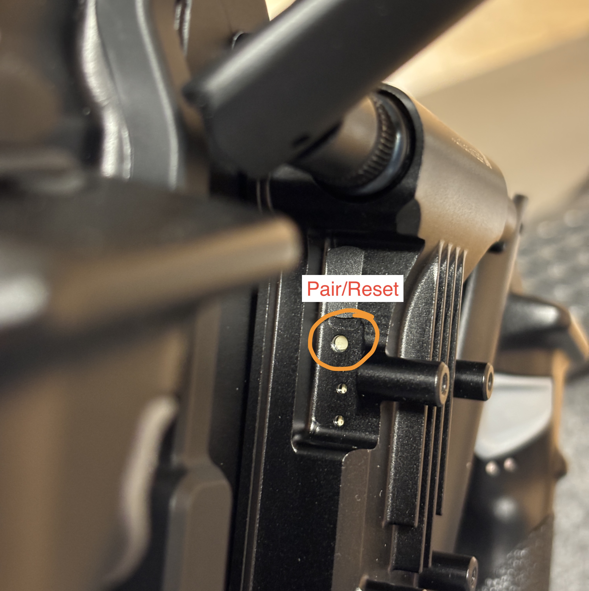

# Herelink Radio

## Binding

* Prepare tweezers or paperclip.




* Power on Astro or Alta X Gen 2 with one battery
*   Find the bind button on the IO Panel - next to the yellow XT connector.

    <figure><figcaption></figcaption></figure>
*   Also locate the external compass module

    <figure><figcaption></figcaption></figure>

* Press on the bind button 3 times. The LED on the external compass module starts to blink fast in white/pink for a few moments, confirming that it is entering binding mode.&#x20;

<figure><figcaption></figcaption></figure>



* Using tweezers, press and hold the Herelink unit's "Pair/Reset" button until LED2 blinks (hold approximately 3 seconds)



## Pilot Pro

*   Using tweezers, press and hold the Pilot Pro Herelink unit's "Pair/Reset" button until LED2 blinks (hold approximately 3 seconds) 

    <figure><figcaption></figcaption></figure>
* Ensure the light goes solid.
* Open the flight app on Pilot Pro (AMC for Astro) and verify the connection to the aircraft
