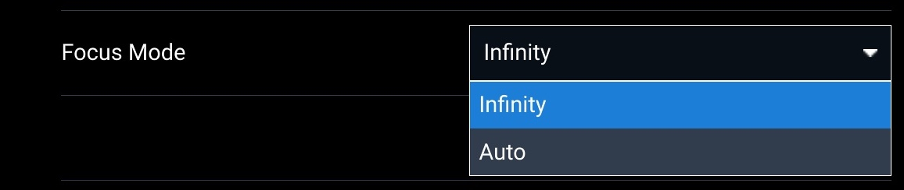

# Technical Specs and Lenses

## Performance

The A7R4 Payload's high pixel count allows you to cover a large amount of area quickly at low resolution, or collect very high-resolution imagery at lower altitudes. Approximate GSD, coverage per flight, and expected altitude are listed below for reference. This is based on a 70% forward and 65% side overlap, single pass (no crosshatch).&#x20;

<table><thead><tr><th>GSD (cm)</th><th width="173.3907504828339">Coverage (acres per flight, single pass)</th><th width="150">Speed (m/s)</th><th>Altitude (m)</th></tr></thead><tbody><tr><td>0.5</td><td>62</td><td>4.75</td><td>31</td></tr><tr><td>1</td><td>98</td><td>9.5</td><td>63</td></tr><tr><td>1.9 (capped by 400ft altitude)</td><td>220</td><td>12</td><td>121</td></tr></tbody></table>

A single Astro flight with the A7R4 Payload is typically 25 minutes. The exact time depends on the survey area's geometry, the number of turns required, and the flight speed, as well as environmental factors such as wind speed and direction. Note that the time presented in AMC is an estimate, and not adding return or transit waypoints may affect its calculation. A good rule of thumb is to aim for an AMC-calculated flight duration of 22-23 minutes. This should allow the flight to complete and return before hitting the battery reserve.

## Camera Body

Sony A7RIV-A&#x20;

<table><thead><tr><th width="479">Parameter</th><th>Value</th></tr></thead><tbody><tr><td>Sensor Size (pixels)</td><td>9504 x 6336</td></tr><tr><td>Sensor Size (mm)</td><td>35.7 x 23.9</td></tr><tr><td>Pixel Size (μm)</td><td>3.76</td></tr></tbody></table>

### Weight

Astro's maximum payload weight is 1500 grams.

<table><thead><tr><th width="479">Parameter</th><th>Weight (g)</th></tr></thead><tbody><tr><td>Smart Dovetail mount</td><td>106</td></tr><tr><td>Weight with no lens</td><td>1162</td></tr><tr><td>Weight with default lens</td><td>1390</td></tr><tr><td>Weight with default lens and mount</td><td>1496</td></tr></tbody></table>

## Gimbal

<table><thead><tr><th width="479">Parameter</th><th>Value</th></tr></thead><tbody><tr><td>Minimum gimbal angle</td><td>-90° (straight down)</td></tr><tr><td>Maximum gimbal angle</td><td>+30°</td></tr></tbody></table>

## Lenses

<table><thead><tr><th>Focal Length (mm)</th><th>Model</th><th width="120">Weight (g)</th><th width="150">Compatability</th></tr></thead><tbody><tr><td>24 (ships with)</td><td><a href="https://www.sigma-global.com/en/lenses/c021_24_35/">Sigma 404965</a></td><td>228</td><td>Supported</td></tr><tr><td>35</td><td><a href="https://electronics.sony.com/imaging/lenses/full-frame-e-mount/p/sel35f28z">Sony SEL35F28Z</a></td><td>165</td><td>Supported</td></tr><tr><td>50</td><td><a href="https://electronics.sony.com/imaging/lenses/full-frame-e-mount/p/sel50f18f-2">Sony SEL50F18F/2</a></td><td>187</td><td>Supported</td></tr></tbody></table>

Lens selection in AMC only matters for mission planning calculations (overlap, photo trigger, etc) and for infinity focus to work properly.&#x20;

If you plan a mission with a non-standard lens, make sure that the correct lens is selected in the Survey section of the Plan screen. If your lens isn't on the dropdown, you can enter the details manually by selecting Custom Camera instead of a specific lens.&#x20;

<figure><figcaption></figcaption></figure>

When changing lenses, select your lens from the Focal Length dropdown in Camera Settings found in the camera settings.&#x20;

<figure><figcaption></figcaption></figure>

If your lens isn't on the dropdown, pick any lens from that menu and use auto-focus.

<figure><figcaption></figcaption></figure>
