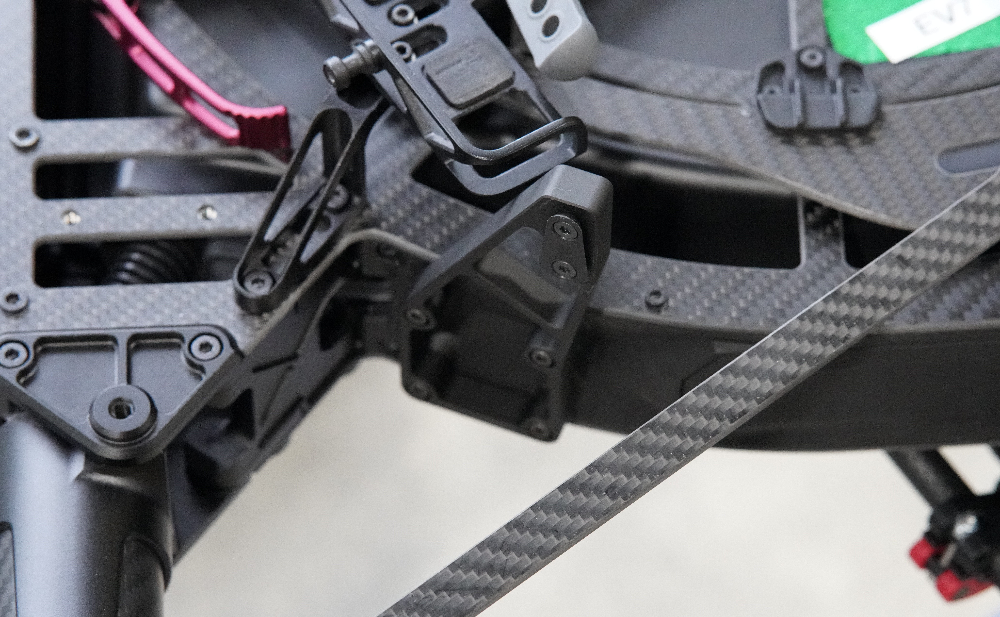
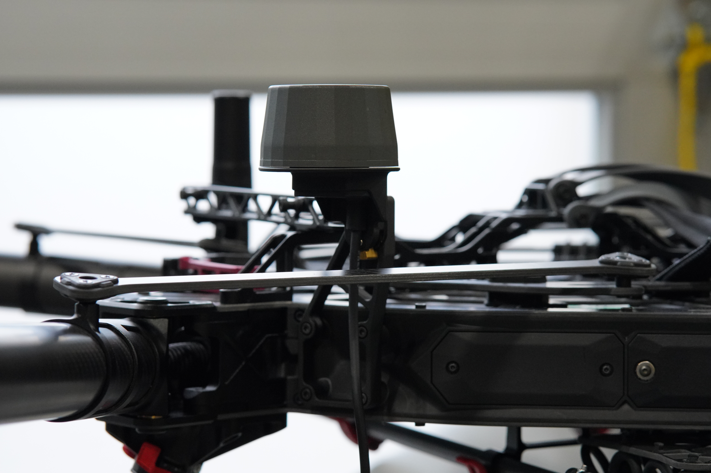

# Installation on Astro/Alta X Gen2

<figure><figcaption></figcaption></figure>

## Install the GNSS antennas

Use the M3 screws provided to mount the GNSS Module mounts on the left and right side of Astro.



.png>)

<figure><figcaption></figcaption></figure>



<figure><figcaption></figcaption></figure>

<figure><figcaption></figcaption></figure>




\#protip - the GNSS mounts can stay on Astro while in transport in the case and when flying other payloads such as LR1


Install the GNSS antennas on to the mounts and slide the lock to secure them in place.



<figure><figcaption>
GNSS Antenna with Pop and Lock
</figcaption></figure>



<figure><figcaption>
GNSS Antenna fully seated
</figcaption></figure>



<figure><figcaption>
GNSS Antenna Locked
</figcaption></figure>




Check the GNSS module locks are secure before every flight - Loose GNSS modules can get tangled in Astro's propellers and cause a crash!


## Attaching the Flux sensor 

Insert the Flash Drive into the sensor and connect Flux to the Smart Dovetail connector. Secure the connection with the red lever.


We recommend flying with 30A isolator durometers. These are the default isolator durometers that ship with Astro and Alta X Gen2




<figure><figcaption></figcaption></figure>



<figure><figcaption></figcaption></figure>



Connect each antenna cable to its corresponding connector. Pull slightly from the cable to check that it is properly locked.


Alta X Gen2 requires extension cables to connect the GNSS modules to Flux


<figure><figcaption></figcaption></figure>


Flux can get **very hot, in particular if powered on while not flying** - use caution when handling Flux or removing it from the payload connector


## Setup your GNSS Base Station 

To process the LiDAR data, a RINEX file is required to post-process the GNSS data from both antennas. This RINEX file contains the raw observation of the GNSS satellites during the scan from a fixed position on Earth. With this information, the computed GNSS position from the LiDAR can be improved dramatically. There are three ways to get this information:

#### Option 1: NTRIP RTK on Astro

In areas with cell coverage, Astro can stream RTK corrections using the LTE module via NTRIP. When Astro is setup with NTRIP, Flux will automatically save this data and include it in the .fluxscan file for processing.


This is the preferred option for most applications as it simplifies the Flux workflow and output accuracy greatly.


An NTIRP provider will be required for NTRIP corrections over LTE. The [Auterion RTK ](https://docs.auterion.com/vehicle-operation/auterion-apps/ntrip-app-and-auterion-rtk)app is free for the Astro and supports 3rd party NTRIP providers. Auterion also provides an NTRIP subscription service for the simplest setup


We recommend using an NTRIP provider that gives corrections in WGS84. The Flow processing app assumes the base station file is in WGS84, so if you use a provider with a different coordinate system, you will need to account for this when importing GCPs or exporting georeferenced point clouds



An active SIM with data is required for NTRIP corrections. Astro's cellular modem supports common frequencies in North America.



Freefly's [RTK GPS Ground Station](https://store.freeflysystems.com/products/rtk-gps-ground-station?_pos=1&_sid=74bc01604&_ss=r) does not work with Flux as it can only receive and forward L1 and L2 GNSS bands. L1, L2, L5, and L6 bands are required for use with Flux


#### Option 2: Third Party Base Station

If you have your own base station capable of logging L1/L2/L5/L6 GNSS in a RINEX file, set it up and leave it logging during the whole scan. You will need a .Obs file to process with at the end of the scan.

We have tested the Tersus Oscar Trek works well with Flux and has the necessary GNSS bands.


V2.11 or 3.X RINEX file is required for processing in the Flow app


#### Option 3: Reference Network

If you do not have your own base station, check that there is a nearby permanent station from which you can download a RINEX file after your flight. There are available several GNSS networks from which these RINEX files can be downloaded, such as [from UFCORS](https://geodesy.noaa.gov/UFCORS/).&#x20;


The further away the reference base station is, the less accurate your scan results will be



V2.11 or 3.X RINEX file is required for processing in the Flow app


## Plan a mission in AMC 


[mission-planning-and-data-capture.md](mission-planning-and-data-capture.md)

