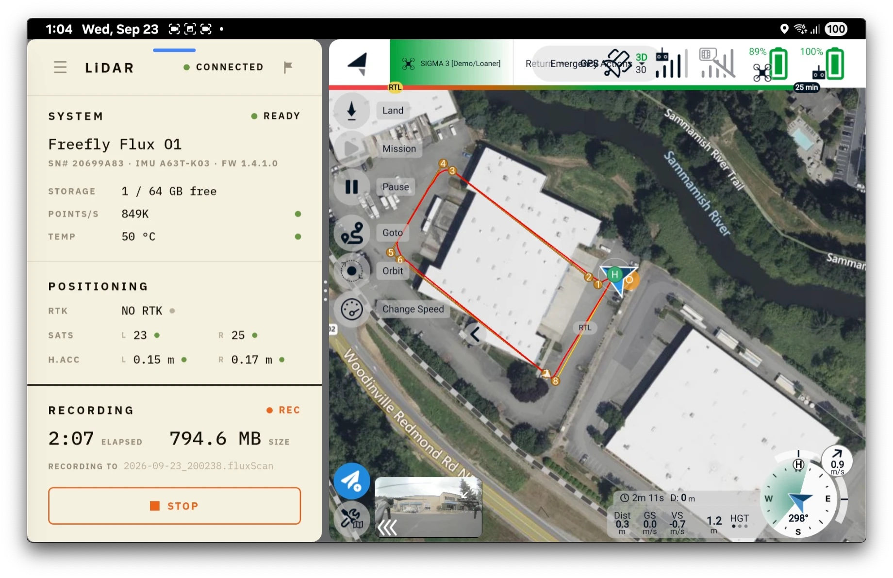

# Mission Planning and Data Capture

## Plan a mission in AMC


Flux sensor presets are available in AMC under the camera presets. Update to AMC version 1.36.22 or later


In AMC, go to the plan screen and tap Pattern --> Survey or Corridor Scan and draw out the area you would like to scan.

Next, select your Flux variant under the camera settings. This will apply the default settings for Flux and simplify the mission planning process.

<figure><figcaption></figcaption></figure>

We recommend the following mission settings for Flux:

|                  | Flux H1                                                                                         | Flux L1                                                                                         | Flux O1                                                                                         |
| ---------------- | ----------------------------------------------------------------------------------------------- | ----------------------------------------------------------------------------------------------- | ----------------------------------------------------------------------------------------------- |
| Flight Height    | Between 20 m to 150 m, depending on surrounding obstacles.                                      | Between 20 m to 150 m, depending on surrounding obstacles.                                      | Between 20 m to 150 m, depending on surrounding obstacles.                                      |
| Track Separation | Set automatically if Flux H1 is selected                                                        | Set automatically if Flux L1 is selected                                                        | Set automatically if Flux O1 is selected                                                        |
| Speed            | 2 to 15 m/s, depending on the point density required. The slower, the higher the point density. | 2 to 10 m/s, depending on the point density required. The slower, the higher the point density. | 2 to 15 m/s, depending on the point density required. The slower, the higher the point density. |


If you are using terrain following, use max climb and descent rates <1.0 m/s. Processing will filter out any lidar points captured while the aircraft is above this vertical rate.&#x20;



Flux uses the first track of the flight for calibration, so it is recommended to have the entry point of your mission as far away from the takeoff point as possible


### Mapping Tips

* In general, long tracks using the preset mission profiles deliver the best results. A crosshatch mission isn't usually necessary unless your scan area has lots of vertical features such as tall skinny buildings or complex geometry.&#x20;

### Power Line/Corridor Scan Tips


Corridor scans can sometimes be filtered out during processing if not setup properly. We recommend flying a small (50-100m) reverse transit before the intended area of the corridor scan as shown below




Recommended

<figure><figcaption></figcaption></figure>



Not recommended

<figure><figcaption></figcaption></figure>



For the best performance on picking up power lines in the scan:

* Place the corridor path _directly_ over the power lines,. Flux can struggle to pick up powerlines from off-nadir angles
* Don't fly higher than is needed for safety, as power lines become harder to detect as the distance increases


Protip: you can fly a quick scan at higher altitudes that is fast, and process it to have a good measurement of obstacles/transmission tower heights. Then plan the actual mission using this info to get closer and fly slower for the required level of detail&#x20;


## Start LiDAR capture and execute the mission 

When you are ready to execute your planned mission, power on the drone. The LiDAR sensor will start loading, and the LED will blink blue. Once it is ready for data capture, the LED will turn solid green. All LED colors are listed in [Payload Overview](../payload-overview.md).

Open the **Flux Mobile App** on the Pilot Pro (see [Setup](setup.md#install-the-flux-mobile-app-on-pilot-pro)). It shows the Flux status:

* GNSS satellites and accuracy for the left and right antennas
* Points per second
* USB storage remaining
* Internal temperature

If you are using an iPad connected to the Pilot Pro, the Freefly Flow app shows the same information.

<figure><figcaption>
Flux Mobile App recording next to AMC in split screen, mid-mission
</figcaption></figure>


Flux relies heavily on GNSS for good performance

For the best results, wait for the left and right GNSS modules to both have 20+ satellites for >1 minute before starting to record and takeoff


Before takeoff, tap **RECORD** in the Flux Mobile App, or push the REC button on the Flux LiDAR, to start capturing LiDAR data. Once the LED turns red, begin flying the mission. There is no need for calibration figures or particular paths.


The L1 will likely display 0 pts (red) while Astro is on the ground. This is normal, the L1 minimum range is 1 meter and L1 will be able to collect points while flying.



Flux will calibrate itself on the way to the entry point of the mission.

We recommend placing the start point as the farthest point from the takeoff point. This will give Flux the best calibration and will allow Astro to be closer to the home point at the end of the mission, allowing for longer flight times before the time-based RTL triggers


After landing, tap **STOP** in the app, or push the REC button on the lidar, to stop recording. The LED will start blinking magenta, indicating the Flash Drive is busy. Once it is ready, the LED will go back to solid green.


Remember to stop recording before turning off the aircraft! If Flux is powered down while recording, the scan data will be corrupted and may not be recoverable.


## Process your LiDAR data in the field just after landing 

Remove the Flash Drive from the LiDAR sensor and process the scan.


[processing-scans.md](processing-scans.md)

