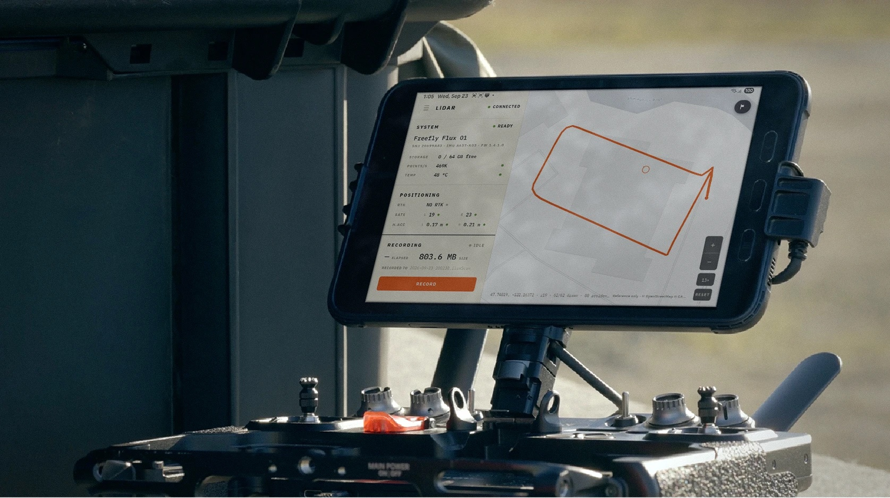

# Setup

One-time setup for Flux: mount the GNSS antennas and the sensor, decide how you will get base station corrections, and install the Flux Mobile App on your Pilot Pro. After this, each mission only needs the steps in [Mission Planning and Data Capture](mission-planning-and-data-capture.md).

<figure><figcaption></figcaption></figure>

## Install the GNSS antennas

Use the M3 screws provided to mount the GNSS Module mounts on the left and right side of Astro.



.png>)

<figure><figcaption></figcaption></figure>



<figure><figcaption></figcaption></figure>

<figure><figcaption></figcaption></figure>




\#protip - the GNSS mounts can stay on Astro while in transport in the case and when flying other payloads such as LR1


Install the GNSS antennas on to the mounts and slide the lock to secure them in place.



<figure><figcaption>
GNSS Antenna with Pop and Lock
</figcaption></figure>



<figure><figcaption>
GNSS Antenna fully seated
</figcaption></figure>



<figure><figcaption>
GNSS Antenna Locked
</figcaption></figure>




Check the GNSS module locks are secure before every flight - Loose GNSS modules can get tangled in Astro's propellers and cause a crash!


## Attaching the Flux sensor 

Insert the Flash Drive into the sensor and connect Flux to the Smart Dovetail connector. Secure the connection with the red lever.


We recommend flying with 30A isolator durometers. These are the default isolator durometers that ship with Astro and Alta X Gen2




<figure><figcaption></figcaption></figure>



<figure><figcaption></figcaption></figure>



Connect each antenna cable to its corresponding connector. Pull slightly from the cable to check that it is properly locked.


Alta X Gen2 requires extension cables to connect the GNSS modules to Flux


<figure><figcaption></figcaption></figure>


Flux can get **very hot, in particular if powered on while not flying** - use caution when handling Flux or removing it from the payload connector


## Setup your GNSS Base Station 

To process the LiDAR data, a RINEX file is required to post-process the GNSS data from both antennas. This RINEX file contains the raw observation of the GNSS satellites during the scan from a fixed position on Earth. With this information, the computed GNSS position from the LiDAR can be improved dramatically. There are three ways to get this information:

#### Option 1: NTRIP RTK on Astro

In areas with cell coverage, Astro can stream RTK corrections using the LTE module via NTRIP. When Astro is setup with NTRIP, Flux will automatically save this data and include it in the .fluxscan file for processing.


This is the preferred option for most applications as it simplifies the Flux workflow and output accuracy greatly.


An NTRIP provider will be required for NTRIP corrections over LTE. The [Auterion RTK ](https://docs.auterion.com/vehicle-operation/auterion-apps/ntrip-app-and-auterion-rtk)app is free for the Astro and supports 3rd party NTRIP providers. Auterion also provides an NTRIP subscription service for the simplest setup


We recommend using an NTRIP provider that gives corrections in WGS84. The Flow processing app assumes the base station file is in WGS84, so if you use a provider with a different coordinate system, you will need to account for this when importing GCPs or exporting georeferenced point clouds



An active SIM with data is required for NTRIP corrections. Astro's cellular modem supports common frequencies in North America.



Freefly's [RTK GPS Ground Station](https://store.freeflysystems.com/products/rtk-gps-ground-station?_pos=1&_sid=74bc01604&_ss=r) does not work with Flux as it can only receive and forward L1 and L2 GNSS bands. L1, L2, L5, and L6 bands are required for use with Flux


#### Option 2: Third Party Base Station

If you have your own base station capable of logging L1/L2/L5/L6 GNSS in a RINEX file, set it up and leave it logging during the whole scan. You will need a .Obs file to process with at the end of the scan.

We have tested the Tersus Oscar Trek works well with Flux and has the necessary GNSS bands.


V2.11 or 3.X RINEX file is required for processing in the Flow app


#### Option 3: Reference Network

If you do not have your own base station, check that there is a nearby permanent station from which you can download a RINEX file after your flight. There are available several GNSS networks from which these RINEX files can be downloaded, such as [from UFCORS](https://geodesy.noaa.gov/UFCORS/).&#x20;


The further away the reference base station is, the less accurate your scan results will be



V2.11 or 3.X RINEX file is required for processing in the Flow app


## Install the Flux Mobile App on Pilot Pro

The Flux Mobile App runs on the Pilot Pro and shows Flux status next to AMC, with Record and Stop on the controller. No iPad or ethernet cable is needed.


The Flux Mobile App requires **Flux Firmware v1.4.1 or later**. See [Flux Software](../maintenance/flux-software.md) to check your version and update.


1. Add the Flux app channel to the Freefly Updater. The Updater does not list the Flux Mobile App until this is done once.
   1. Connect the Pilot Pro to the internet via the wifi settings.
   2. Open the camera app on the tablet, scan this QR code, and copy the link when it pops up.

<figure><figcaption>
Flux app channel for the Freefly Updater
</figcaption></figure>

   3. Open the **Freefly Updater** app.
   4. Go to _Settings > Repositories_ and tap _+ ADD REPOSITORIES_.
   5. Paste the link you copied (or type [http://freefly-updater.freeflysystems.com/v1\_flux/stable\_repo/](http://freefly-updater.freeflysystems.com/v1_flux/stable_repo/)), then exit the Repository menu.
   6. If asked, allow the Freefly Updater under _Install Unknown Apps_ in the tablet's settings.
2. Go to _Latest > Freefly Flux > Install_. See [App Updates](../../../controller/pilot-pro/maintenance/software-and-firmware-updates/README.md#app-updates) if the app does not appear; the Updater may need a refresh.
3. Power on the aircraft with Flux attached and wait for the Pilot Pro to link to it.
4. Open the Flux Mobile App. The header shows **CONNECTED** once data is arriving from Flux.

<figure><figcaption>
Flux Mobile App on Pilot Pro
</figcaption></figure>

The app shows:

* **System**: Flux model, serial number and firmware version, free space on the USB drive, points per second, and sensor temperature.
* **Positioning**: RTK status, satellite count and horizontal accuracy for the left and right GNSS antennas.
* **Recording**: Record and Stop, elapsed time, file size, and the name of the current or last `.fluxScan` file.
* **Map**: the aircraft's path drawn as it flies.


Use Android split screen to keep AMC and the Flux Mobile App side by side, so you can fly the mission and watch Flux on one screen.


## Connecting an iPad to Pilot Pro (legacy)

iPad connection steps

The [Freefly Flow app](https://apps.apple.com/us/app/freefly-flow/id1522046404) can also show live Flux status on an iPad connected to the Pilot Pro. With the Flux Mobile App installed this is no longer needed for monitoring or recording. The steps are kept here for anyone still using it.


Please note that only iPads with M-series chips will be able to process Flux data.&#x20;

iPhone and Macs with M-series chips have also been known to work, but the app is only optimied for iPad.


In order for iPad to communicate with the Pilot Pro, it needs to connect via the ethernet port located on the back of the Pilot Pro. The Flux sensor comes included with the necessary USB-C to Ethernet cable that looks like this:

<figure><figcaption></figcaption></figure>

1. **Connect USB-C to iPad**

<figure><figcaption></figcaption></figure>

2. **Connect Ethernet to the RJ45 port of Pilot Pro**

<figure><figcaption></figcaption></figure>


The shape of your radio and color of your ethernet cable may vary


3. **Doodle Labs Radio Only: Enable RJ45 Access**


If you have the Blue/NDAA variant of Astro or Alta X, the RJ45 port is disabled by default. To enable it, open the Pilot Pro app and navigate to Radio Settings > Advanced.


<figure><figcaption></figcaption></figure>

For more detailed instructions, see [Doodle RJ45 Ethernet Port](../../../controller/pilot-pro/operating-handbook/radio-modules/doodle-labs-radio-module/doodle-rj45-ethernet-port.md).

4. **Configure Ethernet Settings on iPad**

<figure><figcaption></figcaption></figure>

* In Settings > Ethernet, select your ethernet adapter (probably named `USB 10/100/1000 LAN` )
  * **Configure IP** > Set to Manual
  * **IP address**: 192.168.144.120
  * **Subnet Mask**: 255.255.255.0
  * Hit **Save** to apply

This only needs to be set once. The iPad will remember these settings for the future.

5. **Check The Connection**

On the iPad, open a browser (e.g. Safari) and go to `192.168.144.233`

If this page loads the Flux web UI, then your iPad has been successfully configured to communicate with Flux.


Sometimes the record button on the iPad will not work if the iPadOS version is 18.3 or prior. It is recommended to update the iPad to 18.7 or later


## Plan a mission in AMC 


[mission-planning-and-data-capture.md](mission-planning-and-data-capture.md)

