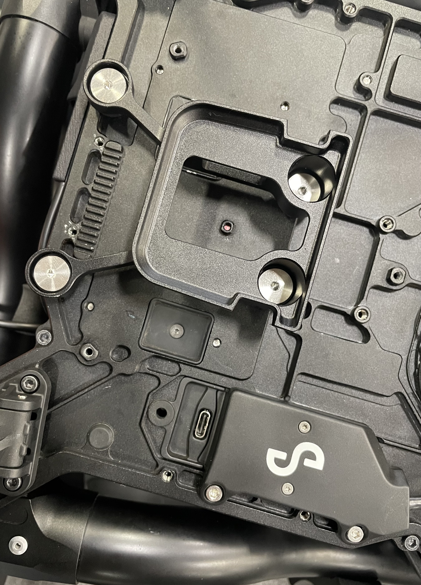
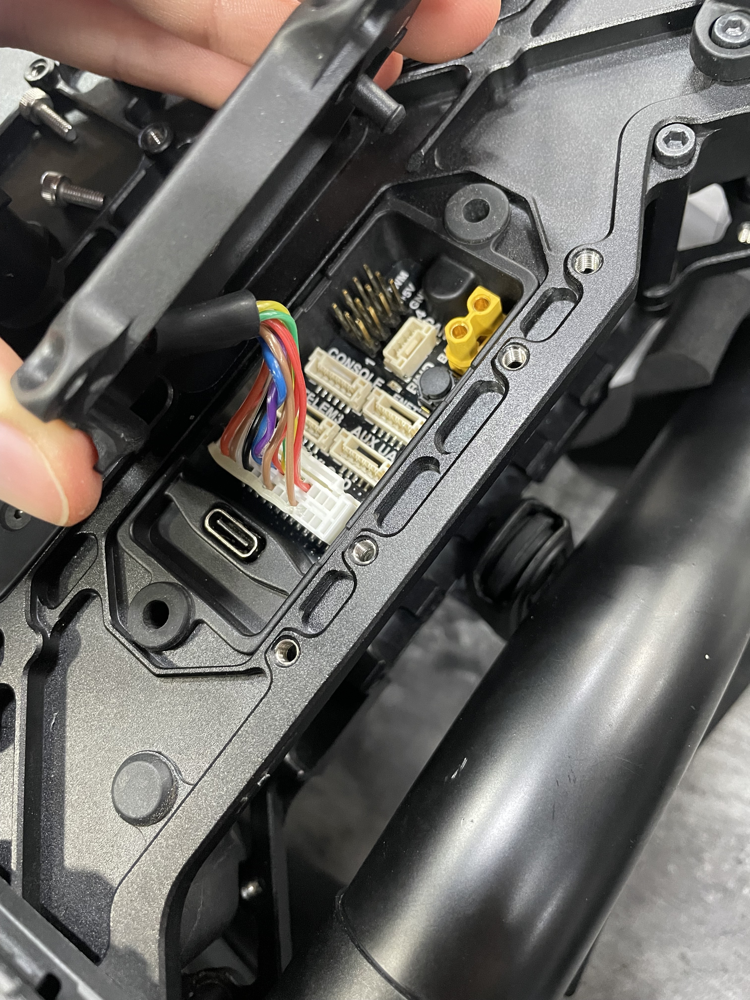
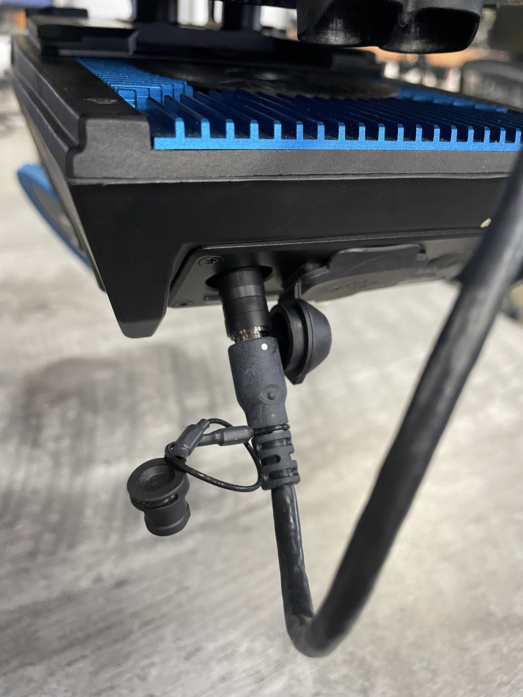
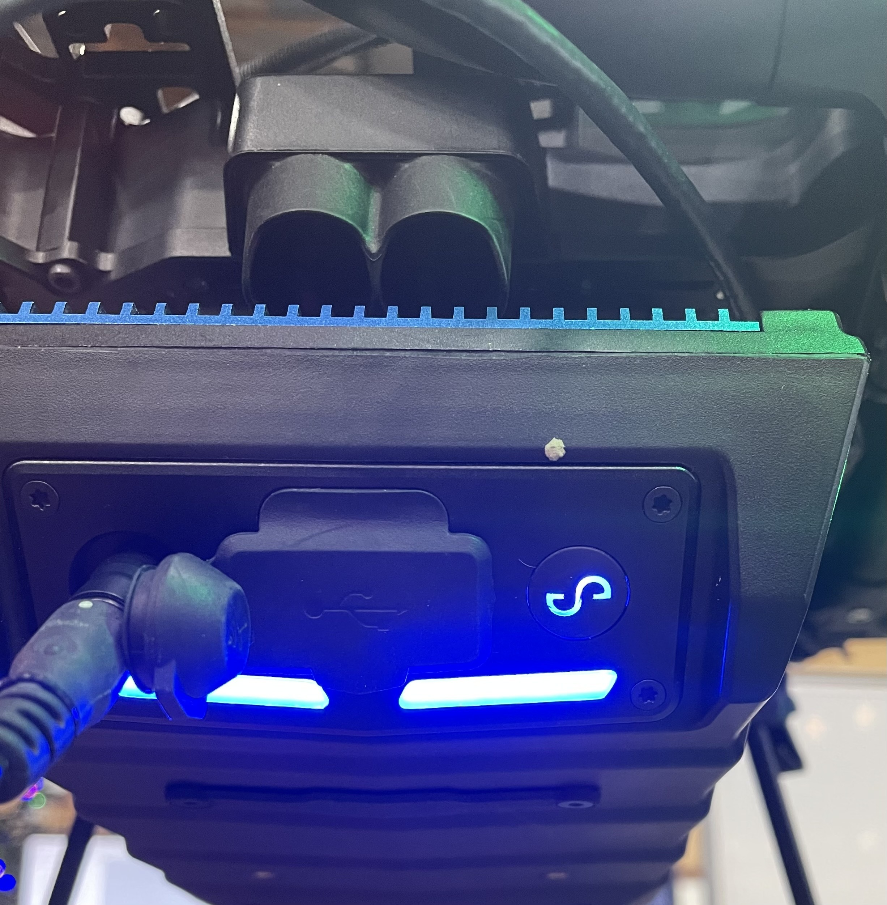
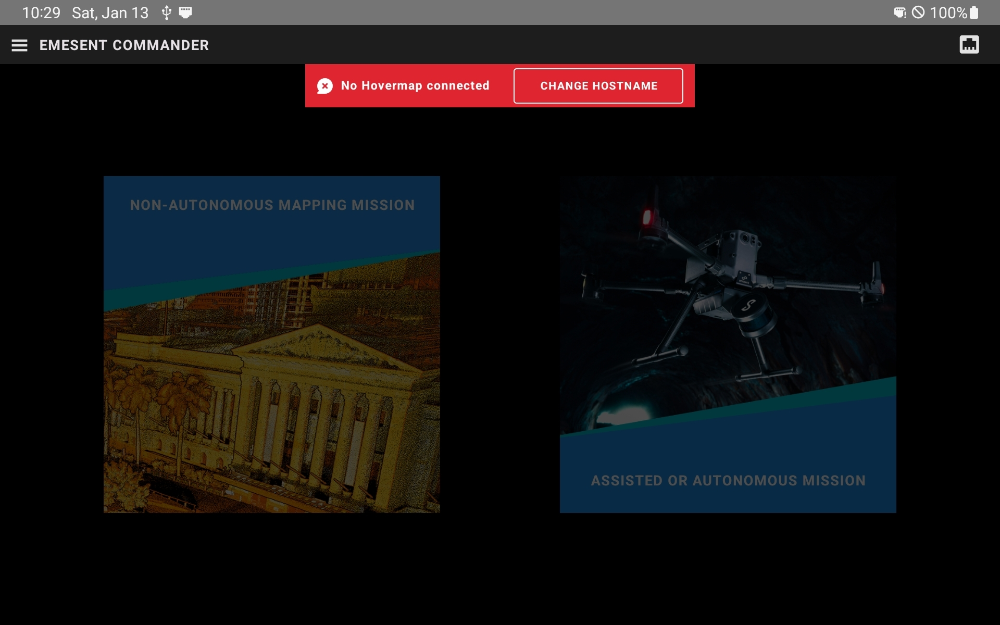
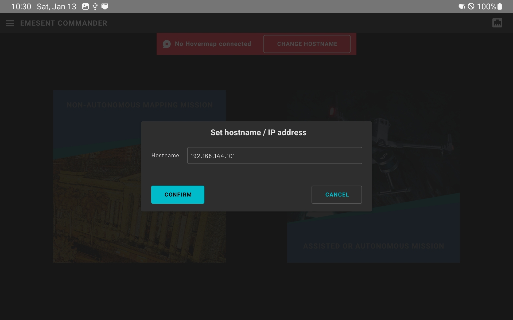

# Hovermap Setup on Astro


Hovermap setup tutorial


### Mounting ST-X or ST on Astro&#x20;

The mounting kit for Astro can be purchase from Emesent and includes the mounting bracket, fasteners, dampers, and IO cover, and cable.&#x20;


Hovermap ST is too heavy for Astro, and can only be flown on Astro Max



Hovermap ST-X and Hovermap ST have different mounting brackets to balanced the CG of aircraft. Ensure you are using the correct bracket. Reach out to Freefly or Emesent support if you have questions


1. Remove the isolator and payload cable from the lower chassis. Then, screw the Hovermap dovetail bracket using the shoulder screws.&#x20;

<figure><figcaption></figcaption></figure>


Use a 2.5mm driver and Loctite 222 on the screws.  Be sure to tighten them down all the way!&#x20;


2. Attach the ZPD connector to the IO panel on Astro.&#x20;

<figure><figcaption></figcaption></figure>

3. Then screw the cover over the IO panel, torquing the bolts to finger-tight.
4. Connect the cable to the back of Hovermap.

<figure><figcaption></figcaption></figure>

### Mapping Only - Astro Parameter Configuration&#x20;

Update your aircraft to the latest firmware to enable Hovermap functionality, at least v1.4.6

### Assisted or Autonomous - Astro Parameter Configuration&#x20;

For assisted and autonomous missions, Astro parameters need to be updated to enable communication with Hovermap and to increase rate setpoint tracking on Astro. See the autonomous section for more details:


[assisted-autonomous-flight.md](assisted-autonomous-flight.md)


### Pilot Pro and Hovermap Configuration


Live preview and connection is currently only supported with Pilot Pro + Astro


1. Install the Emesent Commander App on Pilot Pro. You will need to add your Pilot Pro to the Emesent channel of apps to download it.&#x20;
   1. Connect the Pilot Pro tablet to the internet via the wifi settings
   2. Open the camera app on the tablet
   3. Scan this QR code and copy the link when it pops up

<figure><figcaption></figcaption></figure>

1. Open the Freefly Updater app
2. Go to _Settings > Repositories_&#x20;
   1. Click on _+ ADD REPOSITORIES_
   2. Paste the link you copied from the QR code (alternatively type this:  [http://freefly-updater.freeflysystems.com/v1\_third\_party/emesent/stable\_repo/](http://freefly-updater.freeflysystems.com/v1_third_party/emesent/stable_repo/))
   3. Exit the Repository menu&#x20;
3. You might need to enable _Freefly Updater app_ in Settings under _Install Unknown Apps_
4. Go to Latest > Commander > Install
5. Open the app once it's downloaded
6. Permission Commander access pop up messages
7. Enter&#x20;


The latest tested version of Commander is 2.1


2. Check that Hovermap is up to date on Cortex Firmware. If not, follow Emesent's documentation on [firmware updates](https://emesent.com/portal).


Latest [Hovermap firmware](https://emesent.com/software-downloads/) for Astro is Cortex 4.0

This can be found once connected in the Commander app in the 'Web UI' page


3. Power on Astro, which should also power on Hovermap. Wait until the lights on the back of Hovermap to turn breathing blue.

<figure><figcaption></figcaption></figure>

4. Open Commander the app and click on the ethernet icon in the upper left corner. Click _Change Hostname_ and set the IP address to 192.168.144.101

5. Refresh the Commander app and wait for an ethernet connection to be shown. This may take a few minutes. 
6. You're connected to Hovermap through Astro!

### Hovermap Configuration with Pilot Pro (Doodle Radio)

**Context (Herelink vs Doodle Labs):** On Herelink, standard RC commands are carried over SBUS, so the S2 (Autonomy) switch works with Hovermap with little or no extra setup. On Astro Blue (Doodle Labs radios), there is no native SBUS RC path; Freefly added MAVLink RC\_CHANNELS passthrough support in Pilot Pro Firmware 2.2.0+ to enable S2 forwarding. The steps below are required to configure this on Doodle Labs.

**Summary**: Pilot Pro Firmware 2.2.0+ adds MAVLink RC\_CHANNELS support so the S2 (Autonomy) switch can be forwarded from Pilot Pro → Astro Blue (Doodle Labs radio) → Hovermap.

**Prerequisites**

* Hardware: Astro Blue (Doodle Labs), Hovermap payload, Pilot Pro &#x20;
* Software: Pilot Pro Firmware 2.2.0+, compatible Astro firmware, Emesent Commander &#x20;
* Files:  [HOVERMAP\_EMESENT.yaml](https://freeflyeng.s3.us-west-2.amazonaws.com/_SoftwareReleases/IO_MAPPING_Pilot_Pro_HOVERMAP_EMESENT.yaml) — input mapping preset

**Setup**

1. Configure Astro with Hovermap as [normal](./).
2. **Install & update Pilot Pro -** Follow the [instructions for Pilot Pro](https://freefly.gitbook.io/pilot-pro-public/maintenance/software-and-firmware-updates) to update Pilot Pro Firmware and App so that you are running Firmware v2.2.0 or above.
3. **Import the input mapping**
   1. Copy `HOVERMAP_EMESENT.yaml` to a USB drive; plug into Pilot Pro.
   2. Pilot Pro App → Input Mapping → grant file access if prompted. &#x20;
   3. User Presets → Import → select \`HOVERMAP\_EMESENT.yaml\` → Apply.  (Controls may freeze briefly while settings are applied.)
4. If required, Configure AMC to talk to Astro
   1.  Tablet → open Auterion Mission Control (AMC) → Settings → Comm Links → Add: &#x20;

       &#x20; \- Name: \`Pilot Pro\` &#x20;

       &#x20; \- Type: \`TCP\` &#x20;

       &#x20; \- Host: \`192.168.144.20\` &#x20;

       &#x20; \- Port: \`5790\` &#x20;

       \- Save and Connect.
5. Configure Astro parameters
   1. AMC using Advanced Mode, open Parameters and set
      1. MAV\_0\_FORWARD = Enabled  (forwards S2; but increases CPU load)&#x20;
      2. COM\_RC\_IN\_MODE = Joystick only &#x20;
      3. SER\_EXT\_2\_BAUD = 500000 8N1 &#x20;
      4. MAV\_2\_MODE = Custom &#x20;
      5. SDLOG\_MODE = Disabled (reduces CPU; but disables on-aircraft logging, which will make any incident investigation or troubleshooting much more difficult.)
6. Reboot & verify
   1. Reboot Astro and Hovermap. &#x20;
   2. In Emesent Commander, complete the autonomy setup. (The first scan may fail while parameters are set—repeat once prompted.) &#x20;
7. Confirm the S2 switch state is reflected in Commander before takeoff.

### Mission Planning and Flight

See this section on mapping with Hovermap


[mapping-with-hovermap.md](mapping-with-hovermap.md)


### Assisted/Autonomous Flight

See this section on flying Astro with assisted/autonomy enabled:


[assisted-autonomous-flight.md](assisted-autonomous-flight.md)


### Post Processing&#x20;

Check out Emesent's documentation for details on how to remove data and post-process for ST-X:


[https://emesent.com/portal](https://emesent.com/portal/)

