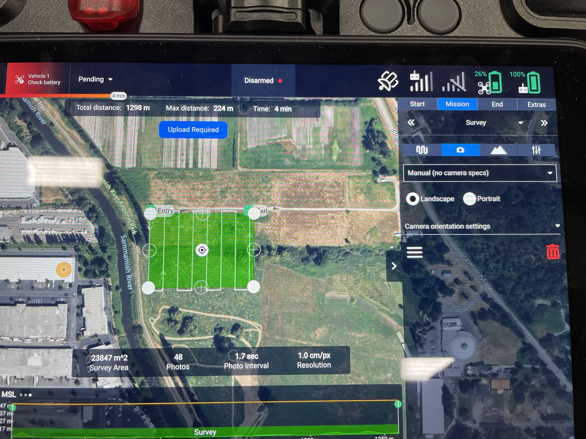
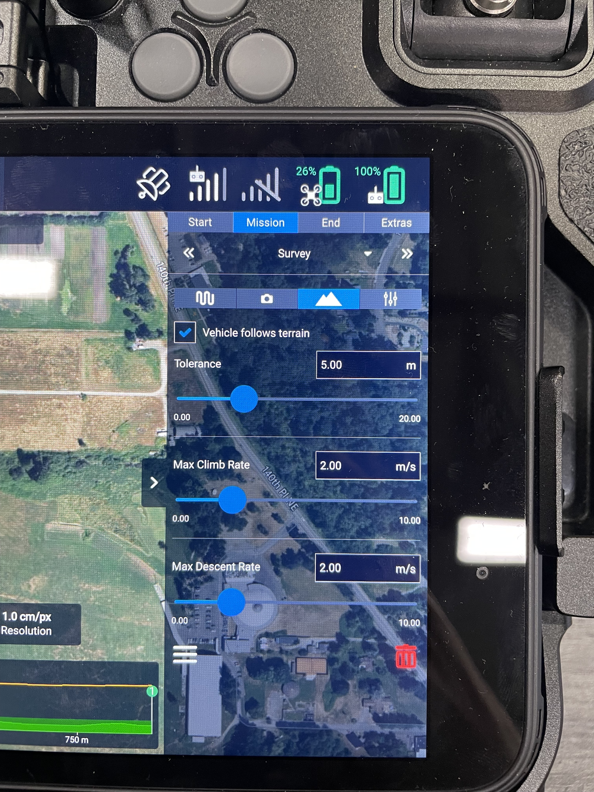
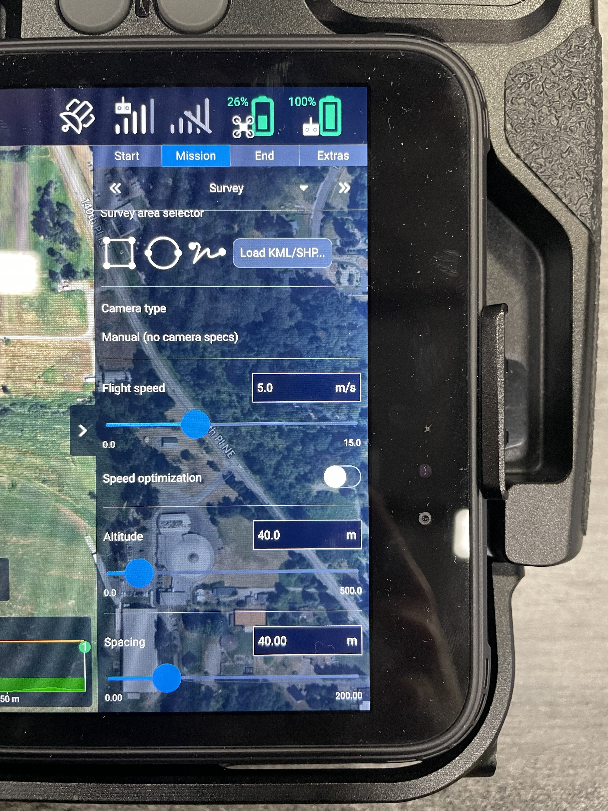

# Mapping with Hovermap

### Mission Planning

Similar to photogrammetry missions, you can plan a mission inside AMC and upload it to Astro. The process is very similar to planning a mission with a mapping camera like the [Sony LR1](../../lr1-payload/). Below is a link to our mapping guides.&#x20;


[photogrammetry-mapping](../../../workflows/photogrammetry-mapping/)


Hovermap ST-X and ST specific notes:

* Flying closer to the terrain or structure will yield better point cloud results. Based on our testing, we recommend staying within **50 meters** of the terrain or structure.


If you do need to fly higher than 40m, slow down the mission speed so the lidar has more time to process and gather points from farther away. In our testing, we wouldn't recommend anything farther than 60m at or above 10 m/s from the subject for good results.



If you see several rotated, intersecting versions of your scan after processing the data, a [SLAM ](https://4999118.hs-sites.com/en/knowledge/understanding-hovermap#WhatIsSLAM)/ [slip ](https://4999118.hs-sites.com/en/knowledge/understanding-hovermap#WhatIsASlip)has likely occurred, and you will need to fly the mission closer and/or slower.


* Set the camera type to 'Manual (No specs)' so that AMC will display the mission planning parameters in distances rather than GSD.

<figure><figcaption></figcaption></figure>

* [Download terrain data](../../../software/auterion-mission-control/amc-plan/offline-maps.md) and enable [Terrain Following](../../../software/auterion-mission-control/amc-plan/terrain-follow.md) on the Plan screen of AMC.

<figure><figcaption></figcaption></figure>

* Instead of setting the mission path based on '% Overlap', set the distance of each track of the mission to be no more than 50 meters apart.
* We recommend flying at around 7 m/s as a starting point for your Hovermap mission. You can increase the density of the point cloud generated by flying slower or lower.

<figure><figcaption></figcaption></figure>

* If your survey area has lots of 3D geometry, check the 'refly at 90' option to get more points on vertical faces and overhangs.

### Flight Tips


Astro + Hovermap ST-X is limited to a maximum ambient temperature of +40C/+104F

Astro Max offers significantly more payload/thrust margin and is recommended for operations at higher altitudes/hotter temperatures



When carrying the Hovermap ST-X, Astro is at the upper limit of its maximum takeoff weight. Be cautious when flying Astro in hot or high-altitude environments.

Astro will give warnings if the ESCs or motors start to overheat. Heed the warnings!

Astro Max offers significantly more payload/thrust margin and is recommended for operations at higher altitudes/hotter temperatures



Astro/Astro Max and Hovermap can operate in light to medium rain. Be sure to insert the USB-C plug in the IO panel


* Hovermap should boot up when Astro is powered on. Hovermap will connect to Astro once the lights turn from orange to a slow blue flash.


Do not plug or unplug the cable while Astro is powered on as this can damage the Hovermap and/or Astro.


* Set up the Hovermap scanning via the Commander app.
  * Click Non-Autonoumous Mapping Mission.
  * Follow the prompts for pre-flight checks.
  * Name your mission and check there is enough free storage on Hovermap.


You may get a caution warning that Shield is disabled, this is normal


* Start the scan and wait for Commander to complete the pre-flight check.
* Once the scanner is running, switch back to AMC to execute the mission.
* You can view a live preview of the point cloud generated by Hovermap during the mission in the Commander app.
* Stop the scan after landing via the Commander app.


For added situational awareness during the mission, you can view a live video from the aircraft using the [Astro FPV Camera](https://store.freeflysystems.com/products/optional-fpv-system-for-astro).

When using the FPV camera, AMC will try to take photos during the mapping mission. To turn this off:

* Set the Start > Camera actions: Stop taking photos
* Turn ON the option under Mission > Options 'Images in turnarounds'



If you power off Astro before stopping the scan, the data can be corrupted!


### Post Processing

Check out Emesent's documentation for details on how to remove data and post-process:


[https://emesent.com/portal](https://emesent.com/portal/)

