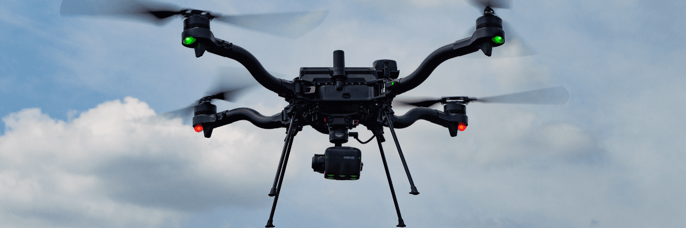

# Sentera 6X/65R

|                    |                                       |
| ------------------ | ------------------------------------- |
| **Description**    | Multispectral sensors for agriculture |
| **Compatibility**  | 
Astro ✅ 

Alta X Gen2 ✅
   |
| **Weight**         | 515–588g (with Smart Dovetail)        |
| **NDAA Compliant** | Yes                                   |
| **Offered By**     | Sentera                               |

<figure><figcaption></figcaption></figure>

Astro and Alta X Gen2 can fly both the Sentera 6X and 65R!

Both payloads are compatible with the Smart Dovetail connector, which sends power and capture commands to the cameras in flight.

## Setup

1. Upgrade the payload software to a compatible version (3.7.0+). Follow the Sentera documentation found [here](https://support.sentera.com/portal/en/kb/articles/firmware-upgrade-6x#6X_Firmware________6X_Thermal_Firmware_______________Download_Update_352_Part__21214_______Download_Update_352_Part__21216).
2. Install the payload in the Smart Dovetail mount
3. Install the GPS mast and cabling securely

For the full details, follow Sentera's installation documentation for your aircraft:


Live video for 65R and other features are available with a firmware update! v4.1.3



[65R installation for Astro](https://support.senterasensors.com/home/65r-sensor-user-guide/65r-sensor/installation/freefly/astro)

[6X Installation for Astro](https://support.senterasensors.com/home/6x-series-sensors-user-guide/6x-series-sensors/installation/freefly/astro)

[6X Installation for Alta X Gen2](https://support.senterasensors.com/home/6x-series-sensors-user-guide/6x-series-sensors/installation/freefly/alta-x-gen-2/sensor-installation)



Make sure any cables are constrained and can't get caught in the propellers


## Mission Planning

As of Freefly aircraft firmware v1.5 or later, the 6X and 65R camera settings are selectable in the survey dropdown of the plan screen. Simply select the camera you are using and adjust the mission flight path as needed.

See Sentera's wiki for the recommended flight settings:

* [65R User Guide](https://support.senterasensors.com/home/65r-sensor-user-guide)
* [6X User Guide](https://support.senterasensors.com/home/6x-series-sensors-user-guide)


**When planning a mission in AMC** - Be sure to set the Camera Action field to 'Survey' and at the bottom of the settings page. This will set the camera to be triggered to take photos during the mission


## Post Processing

[65R Data Offload Process](https://support.senterasensors.com/home/65r-sensor-user-guide/65r-sensor/data-offload)

[6X Data Offload Process](https://support.senterasensors.com/home/6x-series-sensors-user-guide/6x-series-sensors/data-offload)


Use **192.168.42.1** for the IP address



You MUST plug in the USB drive to pull data. Data is not stored on the camera SD card.


#### Tips:

* Turn off your computer wifi connection and ensure the wired network connection is showing connected to "Sentera 65R".
  * Sentera 65R (use this one) > "Data" folder > "snapshots" folder > select date of flight (folder)s
  * Sentera 65 SMB (don't use this one)
* If you leave the aircraft on or hotswap between missions, it'll save all the image in the same folder (annoying for post processing) so ensure you power cycle between missions to make processing easier (create seperate folders).
* In Field Agent (sentera's processing software)
  * Create the field boundary
    * Then in the field menu select said field
    * Go to the map layers tab
    * press the + button in the right corner of the tab
    * Select individual photos from the upload map layer menu
    * Add the images to the upload section

## Technical Specifications

<table data-first-column-sticky data-search="false"><thead><tr><th></th><th>Sentera 6X Multispectral</th><th>Sentera 6X Thermal</th><th>Sentera 65R</th></tr></thead><tbody><tr><td>Resolution</td><td>
2048px by 1536px (Multispectral)

5184px by 3888px (RGB)
</td><td>
2048px by 1536px (Multispectral)

5184px by 3888px (RGB)

320px by 256px (Thermal)
</td><td>9344px by 7000px</td></tr><tr><td>Shutter Type</td><td>
Global (Multispectral)

Electronic Rolling Shutter (RGB)
</td><td>
Global (Multispectral)

Electronic Rolling Shutter (RGB)

Shutterless (Thermal)
</td><td>Global</td></tr><tr><td>Sensor</td><td>
Sony IMX147 (RGB)

Sony IMX265 (Multispectral)
</td><td>
Sony IMX147 (RGB)

Sony IMX265 (Multispectral)

FLIR Boson 320R (Thermal)
</td><td>Gpixel GMAX3265</td></tr><tr><td>Power Input</td><td>10.5 - 26V</td><td>10.5 - 26V</td><td>10.5 - 26V</td></tr><tr><td>Power Consumption</td><td>15W Typical, 18W Max</td><td>15W Typical, 18W Max</td><td>12W Typical, 15W Max</td></tr><tr><td>Capture Rate</td><td>5 FPS (0.2s interval)</td><td>5 FPS (0.2s interval)</td><td>3 FPS (0.333s)</td></tr><tr><td>Storage</td><td>512 GB Internal SSD</td><td>512 GB Internal SSD</td><td>512 GB NVMe SSD</td></tr><tr><td>Filter/Sensitivity</td><td>
Blue: 475nm CWL x 30nm

Green: 550nm CWL x 20nm

Red: 670nm CWL x 30nm

Red Edge: 715nm CWL x 10nm

NIR: 840nm CWL x 20nm

RGB: IR cut 650nm
</td><td>
Green: 550nm CWL x 20nm

Red: 670nm CWL x 30nm

Red Edge: 715nm CWL x 10nm

NIR: 840nm CWL x 20nm

RGB: IR cut 650nm

Thermal Infrared:

Radiometric: 8um to 14um
</td><td>N/A</td></tr><tr><td>Image Format</td><td>
8-bit JPEG (RGB)

12-bit TIFF (MSP)
</td><td>
8-bit JPEG (RGB)

12-bit TIFF (MSP)

16-bit TIFF (Thermal)
</td><td>JPEG</td></tr><tr><td>Weight (With Gimbal)</td><td>515g with Smart Dovetail</td><td>515g with Smart Dovetail</td><td>588g with Smart Dovetail</td></tr><tr><td>GSD @ 200ft (60m)</td><td>
1.0in / 2.6cm (MSP)

0.4in / 1.0cm (RGB)
</td><td>
1.0in / 2.6cm (MSP)

0.4in / 1.0cm (RGB)

6.9in / 17.5cm (LWIR)
</td><td>0.28in (0.7cm)</td></tr><tr><td>Field of View</td><td>47° HFOV (MSP and RGB)</td><td>
47° HFOV (MSP and RGB)

50° HFOV (Thermal)
</td><td>58° HFOV</td></tr><tr><td>Dimensions (Sensor Only)</td><td>79.5mm x 66mm x 67.5mm</td><td>79.5mm x 66mm x 67.5mm</td><td>3.5mm x 70.6mm x 106.4mm</td></tr><tr><td>Dimensions (With Gimbal)</td><td>111.8mm x 126.2mm x 106.4mm</td><td>111.8mm x 126.2mm x 106.4mm</td><td>101mm x 144.8mm x 150.6mm</td></tr></tbody></table>

### Spectral Bands



<figure><figcaption>
Spectral bands of the Sentera 6X Multispectral
</figcaption></figure>



<figure><figcaption>
Spectral bands of the Sentera 6X Thermal
</figcaption></figure>



## More Information

Additional information can be found on Sentera's website:

* [Sentera 6X](https://senterasensors.com/6x/)
* [Sentera 65R](https://senterasensors.com/65r/)
