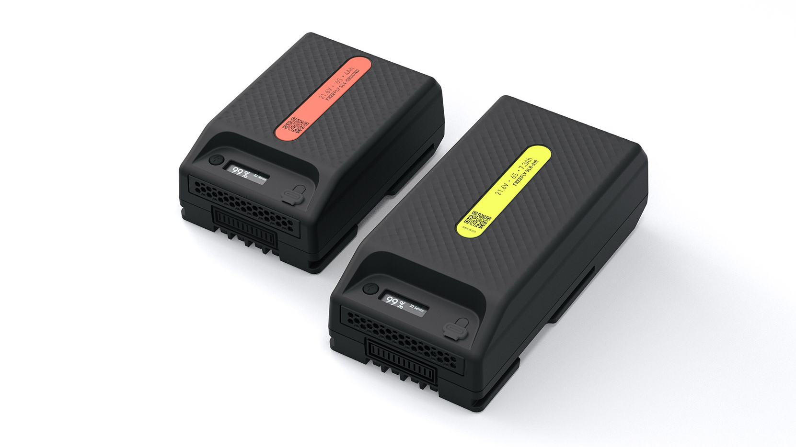

# SuperLight Batteries

SuperLight Lithium-ion batteries are designed and manufactured by Freefly. They work with any device that uses the Freefly Open Battery Interface: Astro today, others coming soon.

Every pack has a built-in Battery Management System (BMS) and OLED screen. The BMS manages discharging and charging without balance leads, and applies many protections during charge and discharge to improve safety, diagnostics and performance. They also include a critical flight mode which limits protections in order to prevent false power cutoff while airborne. The OLED screen gives detailed information about pack status, like state of charge, voltage, current, temperature, life time statistics, etc. The USB-C port can charge devices (such as phones, computers such as MacBookPro, etc) that support USB Power Delivery from 5V up to 20V with 60W.
