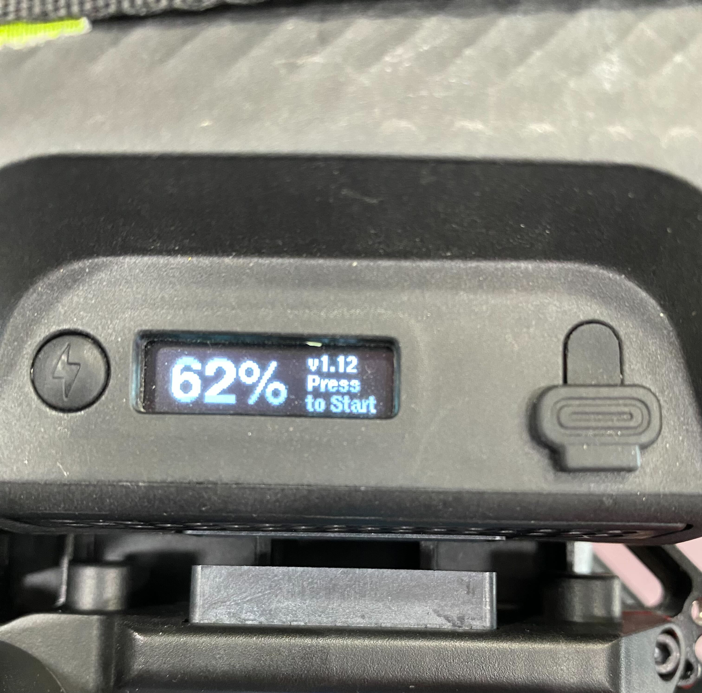

# Maintenance

## Health and Lifecycle

SuperLight Batteries display a Health percentage value, called State of Health (SoH).

State of Health is expressed as a percentage of the ratio of predicted Full Charge Capacity (calculated at 25°C) over the Design Capacity (nominal capacity of a new pack).

### Best practices

To get the most out of your SuperLight packs there are a few things that you can do to improve performance and longevity.&#x20;

#### **Temperature**

Li-ion batteries operate best around room temperature. This means you will get more flight time out of the pack, and less capacity loss over the life of the pack. When able to, we recommend charging your packs after they have cooled from flight, at room temperature for the best longevity.

**Storage**

To store your batteries for long periods of time (months or years) we recommend charging them up to around 50% SoC.&#x20;

### Lifecycle

SuperLight batteries typically have a lifetime significantly longer than 500 cycles. We have tested them to over 1000 cycles with greater than 80% capacity remaining.&#x20;

Over time the batteries will lose some capacity, however, they can continue to be used as long as desired with lower capacity.&#x20;

Superlight batteries should be disposed of in accordance with local regulations on battery and electronic waste.&#x20;

## Hard Reset

In the event that the firmware locks up or an unforeseen issue occurs, there is a method that allows resetting the battery controller. Note, you should not use this in normal operation - it should never be required. That said, if it is unresponsive, you can try this method to reset the battery. Push and hold until the display goes blank, then release the button (approx 15 seconds). The battery will restart.

## Battery Firmware

### Checking Battery Firmware

Tap the button on the SL battery while it is powered off to check the current firmware version.&#x20;

<figure><figcaption></figcaption></figure>

### Updating Battery Firmware

You can find our most recent firmware as well as the firmware updater over on our [Firmware Updates page](firmware-updates.md)

## Fault Codes

The Health screen will show fault codes. If there are multiple fault codes the fault screen will scroll through displaying them.&#x20;

Some faults are latching, and require that a user ejects them from the system re mounts them to try again if the issue has been resolved.&#x20;

| Code          | Message               | Reset?            | Cause and Action                                                                                                                                                                                                                                                                    |
| ------------- | --------------------- | ----------------- | ----------------------------------------------------------------------------------------------------------------------------------------------------------------------------------------------------------------------------------------------------------------------------------- |
| 1 (b0)        | Cell Over Voltage HW  | Remount           | One or more cells is over voltage and this was sensed by hardware. Try allowing to balance by leaving on a charger, then retry. It could also be due to extreme water ingress. Allow battery to dry and retry. Retry a few times, then discontinue use if it persists.              |
| 2 (b1)        | Cell Under Voltage HW | Remount           | One or more cells is under voltage and this was sensed by hardware. Try allowing to charge and balance by leaving on a charger, then retry. It could also be due to extreme water ingress. Allow battery to dry and retry. Retry a few times, then discontinue use if it persists.  |
| 4 (b2)        | Short Circuit Dsg HW  | Remount           | The pack outputs were likely shorted, or extreme high current discharge occurred for too long. Ensure there is no possibility of a short circuit, then retry. Retry a few times, then discontinue use if it persists.                                                               |
| 8 (b3)        | Over Current Dsg HW   | Remount           | A high amount of current was discharged for too long. The application may not be suitable for this battery. If possible, do not load the battery as heavily.                                                                                                                        |
| 16 (b4)       | Over Current Chg      | Remount           | A high amount of charge current was sensed. Make sure a compatible charger is being used. It's also possible to trip this is heavy regen applications such as EVs. Ensure application stays within fault range.                                                                     |
| 32 (b5)       | Over Current Dsg      | Remount           | A high amount of current was discharged for too long. The application may not be suitable for this battery. If possible, do not load the battery as heavily.                                                                                                                        |
| 64 (b6)       | Over Temp Chg         | Cool Down         | Allow battery to cool down, then retry. Optionally, leave charger connected. Charging will resume when temp is below charging limit.                                                                                                                                                |
| 128 (b7)      | Over Temp Dsg         | Cool Down         | Allow battery to cool down, then retry.                                                                                                                                                                                                                                             |
| 256 (b8)      | Over Temp PCB Chg     | Cool Down         | Allow battery to cool down, then retry. Optionally, leave charger connected. Charging will resume when temp is below charging limit.                                                                                                                                                |
| 512 (b9)      | Over Temp PCB Dsg     | Cool Down         | Allow battery to cool down, then retry.                                                                                                                                                                                                                                             |
| 1024 (b10)    | Under Temp Chg        | Heat Up           | Move battery to warmer environment, then retry. Optionally, leave charger connected. Charging will resume when temp is above charging limit.                                                                                                                                        |
| 2048 (b11)    | Under Temp Dsg        | Heat Up           | Allow battery to cool down, then retry.                                                                                                                                                                                                                                             |
| 4096 (b12)    | Under Temp PCB Chg    | Heat Up           | Move battery to warmer environment, then retry. Optionally, leave charger connected. Charging will resume when temp is above charging limit                                                                                                                                         |
| 8192 (b13)    | Under Temp PCB Dsg    | Heat Up           | Allow battery to cool down, then retry.                                                                                                                                                                                                                                             |
| 16384 (b14)   | Discharge Cutoff      | Charge            | Battery is empty. Charge!                                                                                                                                                                                                                                                           |
| 32768 (b15)   | Cells Out of Balance  | Allow balance     | Leave charger connected. This allows the BMS to bring the affected cells back into balance.                                                                                                                                                                                         |
| 65536 (b16)   | Pack Measure Error    | Auto if corrected | There has likely been a hardware error. Retry a few times, then discontinue use if it persists.                                                                                                                                                                                     |
| 131072 (b17)  | Cell Extreme Low V    | None              | There has likely been a hardware error. Retry a few times, then discontinue use if it persists.                                                                                                                                                                                     |
| 262144 (b18)  | AFE I2C Comms         | Auto if corrected | There has likely been a hardware error. Retry a few times, then discontinue use if it persists.                                                                                                                                                                                     |
| 524288 (b19)  | Fuel Gauge I2C Comms  | Auto if corrected | There has likely been a hardware error. Retry a few times, then discontinue use if it persists.                                                                                                                                                                                     |
| 1048576 (b20) | FET Short Error       | None              | There has likely been a hardware error. Retry a few times, then discontinue use if it persists.                                                                                                                                                                                     |
| 2097152 (b21) | FET Over Temp         | Cool Down         | Extreme discharge has likely occurred. Reduce load and retry. Retry a few times, then discontinue use if it persists.                                                                                                                                                               |
| 4194304 (b22) | Reserved              | NA                | NA                                                                                                                                                                                                                                                                                  |
| 8388608 (b23) | Reserved              | NA                | NA                                                                                                                                                                                                                                                                                  |

## Cleaning

Keep debris and moisture out of connectors.

## Hardware Revisions

Different hardware revisions may have different maintenance requirements. Here is how to aquire the hardware revision of the battery:

* Press the button on the battery to cycle through it's screen until you reach to the page that displays "Cycles".&#x20;
* Press and hold until it opens a detailed screen.&#x20;
* Then press and hold again to open manufacturing details screen.&#x20;
* Read the number displayed next to "HW:".
