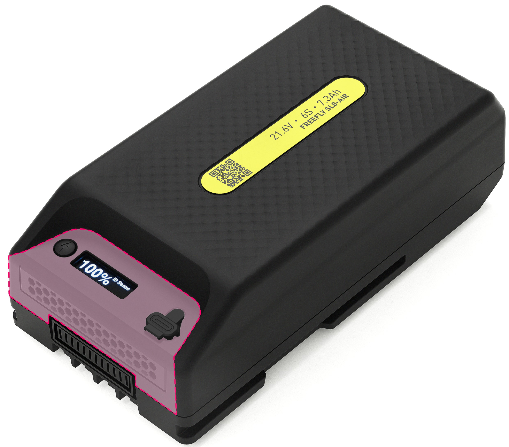
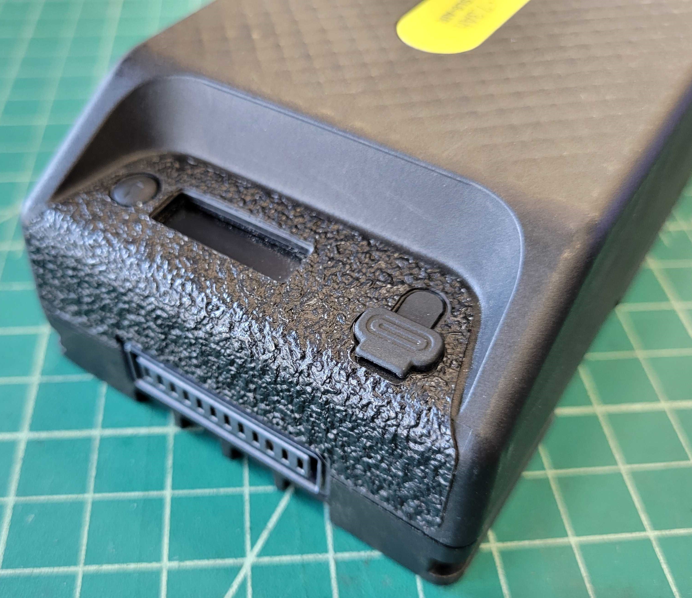

# SL8 ESD Sticker Application Instructions

On July 13th, 2024 Freefly released a service bulletin recommending that customers install ESD stickers to mitigate the risk of damage from ESD into the SL8 heatsink. ESD stickers can be ordered for free [here](https://store.freeflysystems.com/products/sl8-esd-sticker?_pos=1&_sid=a98cee6f9&_ss=r).


ESD issues have been resolved in the newer revisions of the Freefly SL8 Batteries. Manufacturing of these batteries started in the second half of 2024. Specifically, it has been resolved starting with SL8 battery hardware revision 3. See [#hardware-revisions](maintenance.md#hardware-revisions "mention").


Installation

1. Wipe the heatsink and front surface of the SL8 with the included alcohol wipe\
   
2. Let the alcohol fully dry. This can be sped up by dabbing the alcohol with a lint free cloth.&#x20;
3. Apply the ESD sticker to the battery as shown. &#x20;
   1. Remove the backing from the ESD Sticker and discard it.
   2. Align the cutouts in the sticker with the User Button, OLED Screen, and USB Port on the battery and lightly tack it into place.
      1. You may need to lift the USB cover to pass it through the sticker.
      2. If things are not aligned you can gently remove and reapply the sticker for better alignment.
   3. If the sticker aligns well with the UI features, fully adhere that area of the sticker then work downward towards the battery connector applying the remainder of the sticker.
   4. Apply pressure around all of the ESD Sticker's edges to finish the application process.
4. When correctly applied the SL8 Battery should look like the image below.\
   
