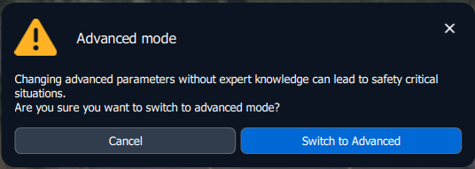

# Parameters

## Accessing Advanced Parameters


Please exercise extreme caution before changing parameters. Do not operate your aircraft with edited parameters unless you are certain you know what you're doing or have been instructed to do so by a Freefly employee.


Parameters are only accessible after [enabling AMC's Advanced Mode](advanced-vehicle-setup.md#activating-advanced-mode)




Enabling Advanced Mode and accessing parameters




1. Enable AMC's advanced mode by rapidly tapping the AMC logo in the top left: 
2. A popup to enable Advanced Mode will appear, confirm that you would like to switch to Advanced mode

<figure><figcaption></figcaption></figure>

3. Tap the AMC icon one more time to open the menu, and more options will now appear. Go into Advanced

<figure><figcaption></figcaption></figure>

4. Now scroll down to the bottom and choose Parameters, and parameters will now be accessible and searchable in the screen to the right

<figure><figcaption></figcaption></figure>



## Advanced Parameter Commands

### Resetting Parameters to Factory Defaults

On occasion you may need to reset the parameters to the vehicle's default. To do this, once you navigate to parameters, click on Tools > Reset to vehicle's configuration defaults

<figure><figcaption></figcaption></figure>

### Loading Parameter Files

Especially in support situations, we may ask you to load a parameter file. To do this, the file will need to be copied into AMC's visible folder so that it can load the file. AMC will be looking for parameters under Documents > Auterion Mission Control > Parameters

To load the parameter file, go to the parameter page and go to Tools > Load from file. As long as the file is in the right location, it should show up and be selectable to import the parameter changes

<figure><figcaption></figcaption></figure>
