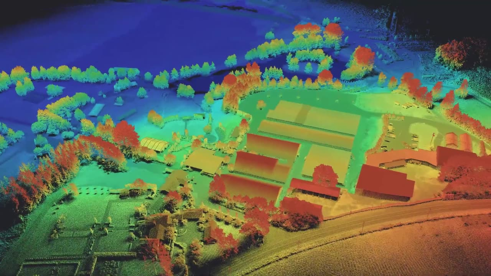
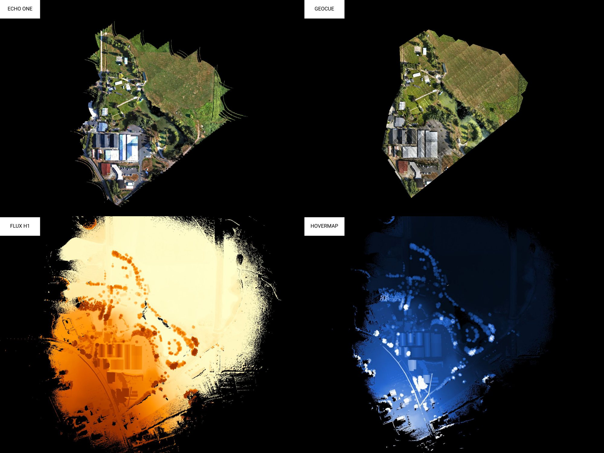
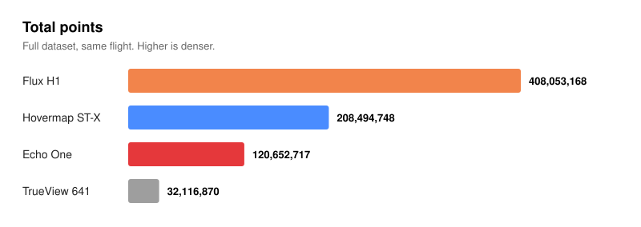
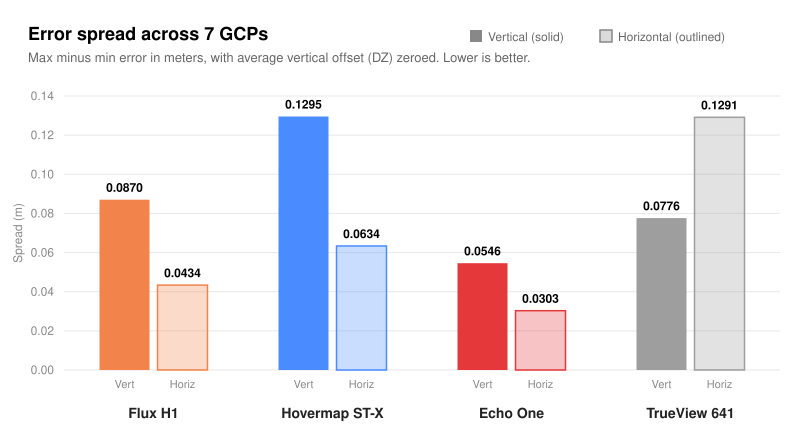
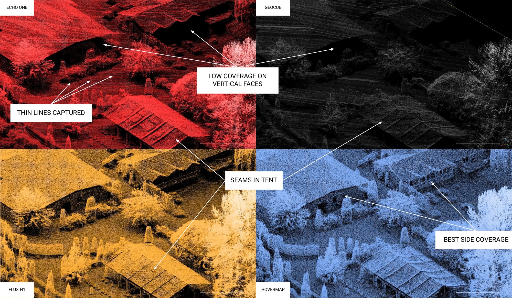
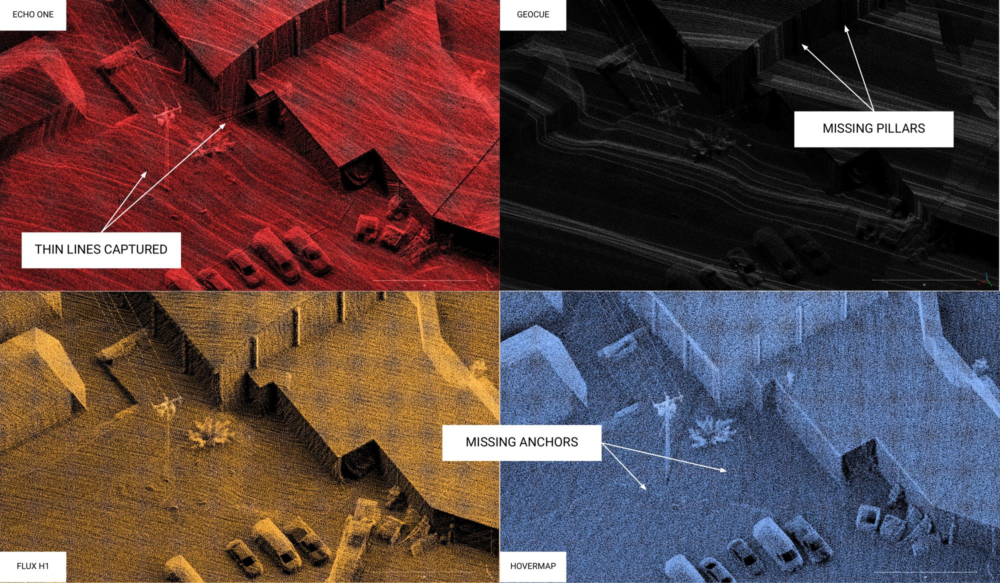
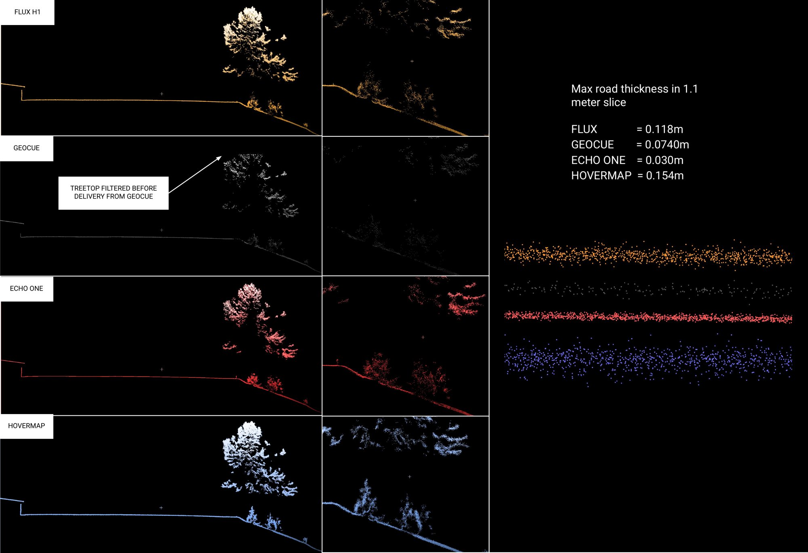
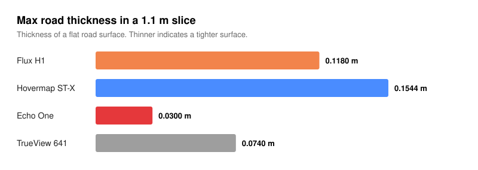
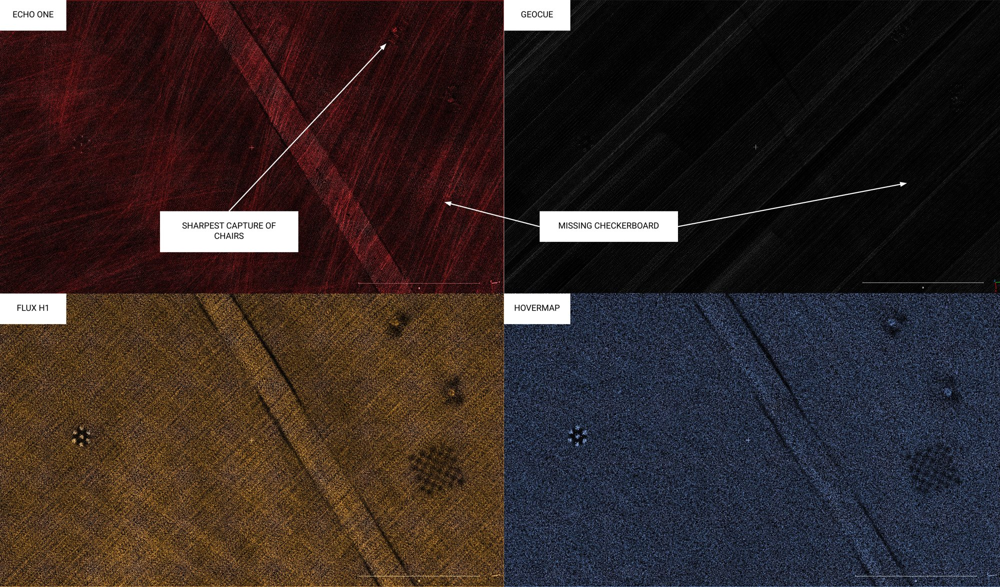

# Lidar Comparison: Freefly Fest 2026

<figure><figcaption></figcaption></figure>

## Four lidars. Same aircraft. Same flight path.

Four of the lidars that were present at Freefly Fest 2026 were flown over the grounds with Astro, each creating its own dataset for comparison.

| Manufacturer | Lidar         |
| ------------ | ------------- |
| Freefly      | Flux H1       |
| Emesent      | Hovermap ST-X |
| Teledyne     | Echo One      |
| GeoCue       | TrueView 641  |

<a href="https://drive.google.com/drive/folders/1hE1qSmbUPfiZwDYNNFgI4Qx2i7okmEeQ?usp=sharing" class="button primary">DOWNLOAD THE DATASETS</a>

<figure><figcaption>
Full dataset overview from each lidar.
</figcaption></figure>

## Test method

| Flight parameter     | Value                     |
| -------------------- | ------------------------- |
| Altitude             | 60 m AGL, terrain following on |
| Flight speed         | 5 m/s                     |
| Ground control points | 7                        |
| Corrections          | NTRIP RTK enabled on Astro |

All lidars were flown on the **same trajectory at 60 m AGL**, terrain following on, at 5 m/s. Astro was flown with NTRIP RTK enabled.

The Echo One and TrueView 641 required additional calibration flight lines that were added to the start and end of the flight. The Echo One, TrueView 641, and Flux units were configured by the manufacturer onsite before flying.

All data was processed by the manufacturers, with the exception of Hovermap, which was processed using the recommended settings in Hovermap's software, Aura.

**7 ground control points** were laid out and are the same in each flight. They are available in the same folder as the datasets.

## How they compare on paper

|                                       | Flux H1                              | Hovermap ST-X                                  | Echo One | TrueView 641 |
| ------------------------------------- | ------------------------------------ | ---------------------------------------------- | -------- | ------------ |
| Price (USD)                           | $32,995                              | $60,470\*                                      | $55,500  | $60,000      |
| Weight (g)                            | 663                                  | 1,560                                          | 1,650    | 2,100        |
| Returns captured                      | 3                                    | 3                                              | 8        | 6            |
| SLAM                                  | Yes                                  | Yes                                            | No       | No           |
| Colorization                          | Yes (20MP camera, not yet enabled)   | Yes (GoPro 360, possible but not captured)     | Yes      | Yes          |
| Requires software subscription        | No                                   | Yes                                            | Yes      | Yes          |
| Requires calibration flight maneuvers | No                                   | No                                             | Yes      | Yes          |
| Requires external OBS file            | No                                   | No                                             | Yes      | Yes          |

\* Pricing for hardware + 1 year mapping license bundle.

## Point density and accuracy

<figure><figcaption></figcaption></figure>

<figure><figcaption></figcaption></figure>

| Lidar         | Total points | Vertical spread (m) | Horizontal spread (m) |
| ------------- | ------------ | ------------------- | --------------------- |
| Flux H1       | 408,053,168  | 0.0870              | 0.0434                |
| Hovermap ST-X | 208,494,748  | 0.1295              | 0.0634                |
| Echo One      | 120,652,717  | 0.0546              | 0.0303                |
| TrueView 641  | 32,116,870   | 0.0776              | 0.1291                |

## Side by side in the cloud

Four areas of the grounds, rendered identically from each dataset. Click any image to enlarge.

### View 1: Buildings and tents

Height colorization.

<figure><figcaption></figcaption></figure>

|                        | Flux H1 | Hovermap ST-X | Echo One | TrueView 641 |
| ---------------------- | ------- | ------------- | -------- | ------------ |
| Vertical face coverage | Yes     | Yes           | No       | No           |
| Thin wire detection    | No      | No            | Yes      | No           |
| Consistent density     | Yes     | Yes           | Yes      | No           |
| Seams in tent          | Yes     | No            | Yes      | Yes          |

### View 2: Pillars and line anchors

Height colorization.

<figure><figcaption></figcaption></figure>

|                       | Flux H1 | Hovermap ST-X | Echo One | TrueView 641 |
| --------------------- | ------- | ------------- | -------- | ------------ |
| Thin wire detection   | No      | No            | Yes      | No           |
| Captured pillars      | Yes     | Yes           | Yes      | No           |
| Captured line anchors | Yes     | No            | Yes      | Yes          |

### View 3: Road cross-section and tree tops

Height colorization.

<figure><figcaption></figcaption></figure>

<figure><figcaption></figcaption></figure>

### View 4: Drainage and checkerboard

Intensity colorization.

<figure><figcaption></figcaption></figure>

|                      | Flux H1 | Hovermap ST-X | Echo One | TrueView 641 |
| -------------------- | ------- | ------------- | -------- | ------------ |
| Drainage visible     | Yes     | Yes           | Yes      | No           |
| Checkerboard visible | Yes     | Yes           | No       | No           |

## Related


[lidar-mapping.md](lidar-mapping.md)



[flux-lidar](../payloads/flux-lidar/)

