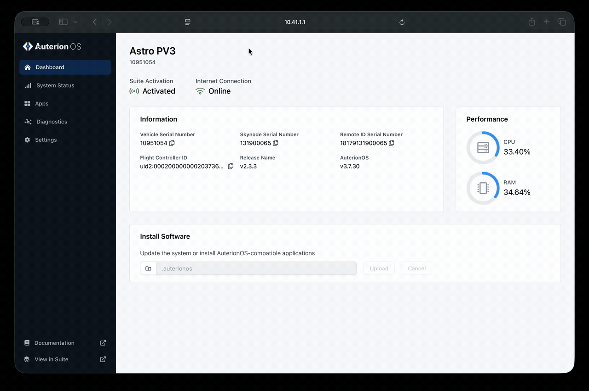

# Disabling Stealth Mode for PPK

The NDAA/Blue variant of Freefly aircraft have Stealth Mode enabled by default. This is a setting that prevents GPS data being logged during flight, to comply with DIU Blue's requirements.&#x20;

If you plan to use PPK for increasing your data's accuracy, you will need to configure some parameters and settings before the necessary files are able to be generated by the aircraft.


Changing aircraft parameters from default values may affect your aircraft's compliance with DIU Blue. For more information, see [DIU Blue sUAS](https://app.gitbook.com/s/8dwrGJhxGd9cIvsStziq/other-user-manuals/compliance/diu-blue-suas "mention")




### Enable Cloud Connectivity

1. Power on the aircraft and Pilot Pro. On the tablet, open a web browser (e.g. Chrome) and navigate to `192.168.144.20`&#x20;
   1. Alternatively, you can access this page by connecting the aircraft to your PC with a USB-C cable and navigating to `10.41.1.1`&#x20;
2. Log in with your password (check your aircraft's documentation for the default password if you do not remember changing it).
3. Navigate to Settings, and under Cloud Connectivity, enable **Cloud Services** and **Flight Log Upload**. Click on the blue Enable button to reboot Astro.

<figure><figcaption></figcaption></figure>


This will not inherently upload any data to the cloud. Enabling these cloud services is a prerequisite for Astro's log streamer backend service to run, which is needed for the PPK files to be generated after a flight.&#x20;




### Modify Advanced Parameters

1. In AMC, activate [Advanced Mode](https://app.gitbook.com/s/8dwrGJhxGd9cIvsStziq/pilots-operating-handbook/essential-software/auterion-mission-control/amc-vehicle-setup/parameters#accessing-advanced-parameters).
2. Navigate to Advanced > Parameters
3. Use the filter/search box at the top to find and modify the following parameters.
4. After modifying a parameter value, be sure to hit SAVE.&#x20;

<table><thead><tr><th width="173.01171875">Parameter</th><th>Value</th><th>Description</th></tr></thead><tbody><tr><td><code>SDLOG_NO_POS_DAT</code></td><td>Set to <strong>Disabled</strong></td><td>Removes the stealth log feature, so GPS data can be logged to USB.</td></tr><tr><td><code>GPS_DUMP_COMM</code></td><td>Set to <strong>RTCM Output (PPK).</strong> This may be already set by default in newer firmware.</td><td>Enables the communication dump, so PPK files can be generated.</td></tr><tr><td><code>SYS_DM_BACKEND</code></td><td>Set to <strong>SD Card.</strong></td><td><strong>Optional</strong>, but recommended. Saves mission data to internal storage, rather than RAM. This prevents excessive RAM usage warnings. </td></tr></tbody></table>


Astro will need to reboot before these parameter changes are applied




### Run a Test Flight

1. **Reboot** Astro after all the parameters have been modified.&#x20;
2. In the Fly view, open the camera settings and set **Image Storage** to **External USB**. &#x20;
3. Perform a quick test by _arming_ the drone in a safe place, and capturing at least one image manually.&#x20;
4. _Disarm_, and allow the task to complete before removing the USB, or the files may become corrupted.


The files will _not_ be generated if you save images to the camera's SD card.&#x20;




### Verify Files

In the USB drive, you should find the following files:

| File Name         | What Is it?                                                                                              |
| ----------------- | -------------------------------------------------------------------------------------------------------- |
| `*-capture.obs`   | The RINEX observation data from the aircraft's RTK antenna.                                              |
| `imagelog.json`   | The log of all image names and their associated data such as altitude, quaternions,  trigger index, etc. |
| `*-sequence.json` | The log of all captures, precise timestamps, and vehicle attitude                                        |



### Use PPK Software

Now that you have the PPK artifacts above, you can use them in combination with your base station's files to correct your image metadata for centimeter-level accuracy. For more information on how to do this, see [PPK Software](ppk-software.md).&#x20;



### Still having trouble?

[Getting Technical Support](https://app.gitbook.com/s/8dwrGJhxGd9cIvsStziq/pilots-operating-handbook/getting-technical-support "mention")
