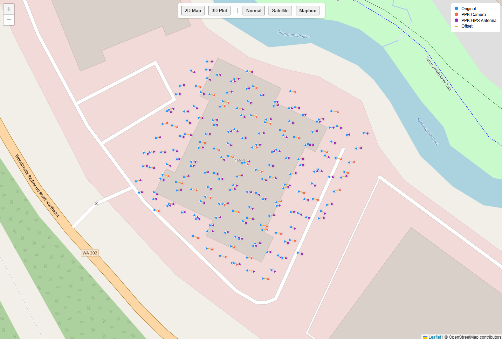

# PPK Software

## Freefly PPK

Freefly PPK Desktop Application takes photos and GPS data generated by Astro or Alta X Gen2 during a Mapping mission, as well as data from a GNSS base station, and applies the Post-Processing Kinematics (PPK) algorithm to tag photos with highly accurate geotags.

**Download** the software from [https://freeflysystems.com/support/astro-support](https://freeflysystems.com/support/astro-support)

Current PC Version: v1.2.2 - Released 01/2026

#### Compatible Devices

**Operating Systems**

* **Windows PC - Tested on Windows 11**

#### GNSS Base Stations

The following base stations have been tested, but generally any device that can output RINEX (Observation and Navigation data files) can be used

* Trimble R2, 10, 12, R12i
* Emlid RS2, RS4 Pro
* Tersus Oscar

#### Input

* Output folder from High Res Mapping Payload.
* RINEX files (OBS and Nav Data files) from GNSS base station _(that was actively recording GNSS data for the full duration of the time that the Astro mission was running)_.
* GNSS base station coordinate
  * Using pre-surveyed point as reference coordinate
  * Using Reference Network calculation (i.e. NOAA's CORS, Washington state's WSRN)
  * For very basic results, averaged value from base station rinex file

#### Output

Photos in PPK\_Photos folder with corrected geotags.

### Workflow

#### 1. Field Operations & Data Capture

* Start the Base Station: Set up your GNSS base station and begin recording satellite data. Ensure you have a solid fix before flying.
* Execute the Flight: Fly your mapping mission with your Astro or Alta X Gen2. Wait for the aircraft to finish processing photos after landing before powering down.
  * _Firmware 2.1.3 Note:_ Ensure `GPS_DUMP_COMM` is set to RTCM output (PPK) prior to flying. This is the default, but if you recently used RTK and changed this parameter, you must switch it back to get the PPK files.
  * _Blue Aircraft Note:_ Disable the `SDLOG_NO_POS_DAT` parameter prior to flying to ensure PPK files are generated.
* Stop the Base Station: Once the flight is entirely complete, stop the base station capture and save the data in RINEX format.

#### 2. Data Consolidation (Pre-Processing)

* Retrieve Drone Data: Remove the USB-C drive from the aircraft, connect it to your computer, and locate the mission folder. It should contain your photos alongside the PPK artifacts: `imagelog.json`, `*sequence.json`, and `*capture.obs`&#x20;
* Retrieve Base Station Data: Locate your RINEX files. They typically end in `.<##>O` (Observation), `.<##>N` (Navigation)
* Merge the Data: Copy the RINEX files directly into the mission folder alongside your photos and drone PPK files.


Pro Tip: For significantly faster processing, copy this entire unified folder to your computer’s local hard drive rather than running the software directly from the USB thumb drive.


#### 3. Freefly PPK Application Setup

<figure><figcaption>
Freefly PPK Application
</figcaption></figure>

* Load the Project: Open the Freefly PPK app and click 'Browse for project...' to select your unified mission folder. The app will automatically scan and map the required files.
  * _File Extension Fix:_ If files with a `26<x>` extension aren't auto-detected, use the Modify button to link them manually, or rename them to `25<x>` and reselect the folder.
* Define Base Station Coordinates:&#x20;
  * Manual (High Accuracy): If the base station location is known, this will lead to the most accurate results. High accuracy base station coordinates are often from the base station being placed on a GCP, or using a correction network to give a better coordinate than the base station alone (e.g., WSRN, NOAA CORS). Enter the known ground coordinates as Decimal Degrees, or toggle DMS Coordinates box to input Degrees/Minutes/Seconds (ensure correct signs, e.g., `-122` for West).
  * Average from OBS (Rough Estimate): Select AVERAGE FROM OBS from the dropdown. This applies single-point positioning for a quick estimate, which will appear in the status bar during processing.


The reference frame that the base station coordinate is entered in will be the reference frame that the photos are outputted in


* Coordinate Systems: The HorizCS and VertCS fields are not used in data processing. These are used to update the photo tags, but do not influence processing. Setting these to the correct coordinate system may reduce steps on choosing your coordinate systems in your processing software.&#x20;
* Antenna Height: Enter the receiver height from the ground (check your tripod pole). The app will automatically adjust the antenna phase center based on the inputted height
  * If you corrected your base station coordinate with a reference network and your corrected coordinate is the phase center of the antenna, you do not need to input an antenna height. If you corrected for the ground point, you will still need to add antenna height.
* Output Preferences: The default 'CSV and Photos' option will create a PPK\_Photos folder to store the corrected images, but if reprocessed, it will overwrite the output folder with the current processing output. It is set to overwrite by default since the application can otherwise keep making copies of the photos and take up a lot of space on your computer. If the output type is set to 'CSV and New Photos', then the application will rename the previous folder and save the output of the current processing to PPK\_Photos.


TIP: you want to explore output with multiple settings (i.e. different base station coordinates or base station files), it might be beneficial to rename the PPK\_Photos folder to something more useful


*   Offset:

    * Select the correct aircraft that gathered the dataset to ensure the correct offsets to the camera are applied during processing
    * When selecting a manual offset, the measurement will be from the center of the GPS antenna to the center of the camera sensor with X going forward, Y to the right, and Z down

    <figure><figcaption>
Manual Offset Directions
</figcaption></figure>

#### 4. Processing & Quality Validation

* Run It: Click Process. _Note: Do not close any pop-up command prompt or terminal windows that appear—these are running the background calculations._
* Verify Quality (Q-Value): Monitor the output in the `PPK_Photos` folder. Your original images remain untouched. Check that most geotags read Q=1 (Fixed/Great) or Q=2 (Float/Okay). Anything higher is inaccurate.
* Once processing has completed, a new 'PPK Analysis Report' button will appear at the bottom of the app to further analyze your processing results

<figure><figcaption>
PPK Application Analysis Report button after processing
</figcaption></figure>

* When opening the Analysis, this will open a browser window showing the original location, PPK'ed GPS antenna location, and the PPK'ed photo location

<figure><figcaption>
PPK Analysis 2D Plot with the Normal Map view
</figcaption></figure>

* The top bar contains options to change the map layers between Normal (vector map), Satellite, or Mapbox. If choosing Mapbox, you will need to enter your Mapbox Token

<figure><figcaption>
PPK Analysis 2D Plot Mapbox Token Entry
</figcaption></figure>

* If you select one of the points on the 2D map it will bring up additional information about the results, showing the photo and info about the PPK correction

<figure><figcaption>
PPK Analysis 2D Plot Photo Comparison
</figcaption></figure>

* By selecting '3D Plot' you can view a 3D graph showing the exact locations to spot check your PPK results. Each point can also be hovered over to show exact coordinates

<figure><figcaption>
PPK Analysis 3D Plot View
</figcaption></figure>

* In the 3D plot view, scrolling will zoom in and out, right-click and drag will reposition the chart, and left-click drag will rotate the chart

<figure><figcaption>
PPK Analysis 3D Plot Movement
</figcaption></figure>

If you have any issues with Freefly PPK and have questions for the Freefly Support team (support@freeflysystems.com), it would help if you sent as many of your files as you are able to (i.e., contents of working directory, capture.obs, sequence.json, and base-directory folder). It also helps to include a screenshot of the application if there's an error.

## Precise Flight

[Precise Flight](https://docs.auterion.com/vehicle-operation/auterion-apps/precise-flight) by Auterion is an alternative option for the PPK workflow. It can be downloaded when logged into the Auterion Suite

