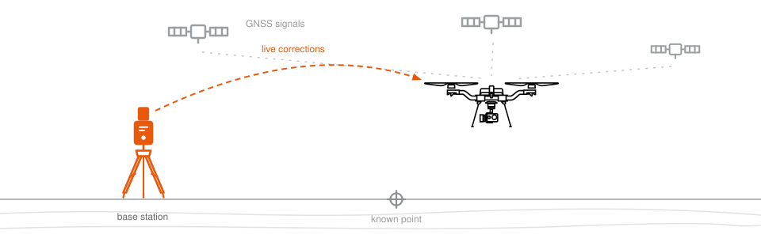
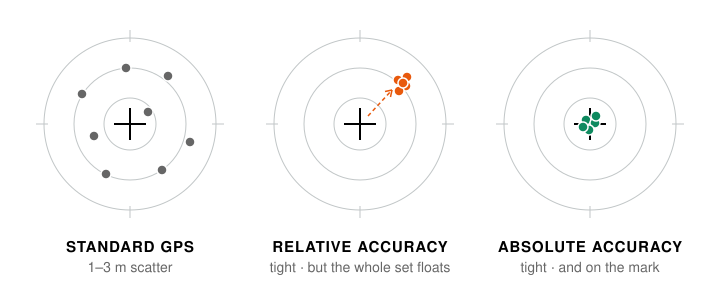
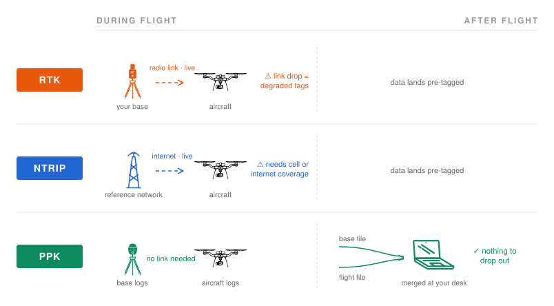

# RTK, NTRIP, PPK: Which One Do You Need?

<figure><figcaption></figcaption></figure>

Out of the box, GPS knows where your aircraft is to within a meter or three. Corrections get that down to centimeters. But the three ways of getting corrections solve **different problems**, and the most common mistake we see is buying one because the acronym sounds familiar. Here's how to pick the right tool.


In a hurry? Jump to [Just tell me which one to get](rtk-ntrip-ppk.md#just-tell-me-which-one-to-get).


## Relative accuracy is not absolute accuracy

Nearly every RTK question we get traces back to this. "Centimeter accuracy" can mean two different things, and they don't come from the same place.

<figure><figcaption>
Same drone, three outcomes. The cross is the true position.
</figcaption></figure>

RTK always buys you the tight cluster. Whether that cluster sits _on_ the cross comes down to one thing: how well the base station knows its own position. A base that averaged its position for a few minutes (Survey-In) gives you the middle picture. A base on a surveyed point, an NTRIP network, or post-processed base data gives you the one on the right.


**Why this trips people up**

Surveyor-grade base stations aren't special because of the letters "RTK." They're special because they're built to occupy a known mark precisely: tribrach mounts, measured antenna heights, calibrated offsets. We'll be straight with you: the Freefly RTK Base Station isn't built for that job. It's built to get your aircraft flying and tagging with excellent _relative_ accuracy in a few minutes, with zero survey knowledge required. Both are great tools. They're not the same tool.


## Three paths, one key difference: what can break mid-flight

RTK and NTRIP correct your position live, so they depend on a live link. PPK corrects it afterwards, so there's nothing to lose.

<figure><figcaption>
Who talks to whom, and when. The dashed line is takeoff to landing.
</figcaption></figure>

RTK and NTRIP do their work on the left side of the dashed line. That's why they improve the flight itself, and it's also why a dropout mid-flight ends up in your deliverable. PPK does all its work on the right side: the aircraft flies on standard GPS, and every position gets recomputed afterwards from complete log files. Same math, but nothing has to work in real time.


**Bonus: absolute accuracy without a surveyed point**

Never touched a survey marker? No problem. With PPK you can post-process the base station's _own_ position against public CORS networks (OPUS in the US, similar services elsewhere), which makes PPK the most accessible path to true absolute accuracy. The methods also stack: fly NTRIP for real-time performance, then run PPK for the final deliverable.


## Just tell me which one to get

Start from what you need, not from the acronym on the box. Answer two questions by picking a tab.

**1. Do you have internet or cell coverage at your site?**



**2. What are you flying?**




**NTRIP.** Flux needs the L1/L2/L5/L6 bands, which our base station doesn't forward, and it saves the correction stream right into the .fluxscan file.





**NTRIP.** Absolute accuracy with zero extra gear. Add PPK on top when a deliverable has to be survey-grade or deterministic.





**NTRIP**, probably. Same real-time performance with nothing to buy or carry. The **Freefly RTK Base Station** is the pick if you'd rather not depend on coverage.






**2. What are you flying?**




**PPK with a multi-band base.** Flux processing accepts external observation files, so log raw GNSS on a base that covers L1/L2/L5/L6 and bring the file in at processing. Our RTK base won't work here, it forwards L1/L2 only.





**PPK.** No internet needed, nothing to drop out, and CORS post-processing gets you true absolute accuracy.





**Freefly RTK Base Station.** You want flight performance and tight relative tags with no internet in sight, and that's exactly what it's built for.






### All three at a glance

| You need...                                                                                          | Get                                                             | The catch                                                                                                              |
| ---------------------------------------------------------------------------------------------------- | --------------------------------------------------------------- | ---------------------------------------------------------------------------------------------------------------------- |
| Rock-solid position hold and tightly consistent (relative) data tags. No internet at your site.      | **RTK** Freefly RTK Base Station                             | One more thing to carry, set up, and power. And your absolute position floats unless the base sits on a known point. |
| Real absolute accuracy with the least gear, and you have cell or internet coverage.                  | **NTRIP** Subscription or free network, no hardware          | Only as good as your coverage. A dropout mid-flight degrades the tags for that stretch.                              |
| Survey-grade deliverables, or results that can't be at the mercy of a live link.                     | **PPK** A logging GNSS base, e.g. Emlid Reach                | Accuracy shows up after the flight, not during it. And there's a processing step waiting at your desk.               |


**You might need none of them**

Honest answer nobody selling base stations gives you: RTK earned its reputation back when drone GPS was mediocre and position hold genuinely needed the help. Astro and Alta X Gen 2 hold position just fine on standard GPS. If you're not producing measured deliverables, save your money and skip the tripod.



**Flying the Flux LiDAR?**

Use NTRIP. Our RTK Base Station forwards only the L1/L2 GNSS bands, and Flux needs L1, L2, L5, and L6. Flux saves the NTRIP correction stream straight into the .fluxscan file for processing; it's the correction source Flux was designed around. No coverage at your site? Flux processing also accepts external observation files, so a multi-band logging base and PPK gets it done.


## Next steps


[rtk.md](../controller/pilot-pro/operating-handbook/ecosystem/rtk.md)



[ppk-software.md](photogrammetry-mapping/ppk-software.md)



[flux-lidar](../payloads/flux-lidar/)


Still not sure which fits your workflow? [Ask us](https://freeflysystems.com/contact), we'll help you figure it out.
